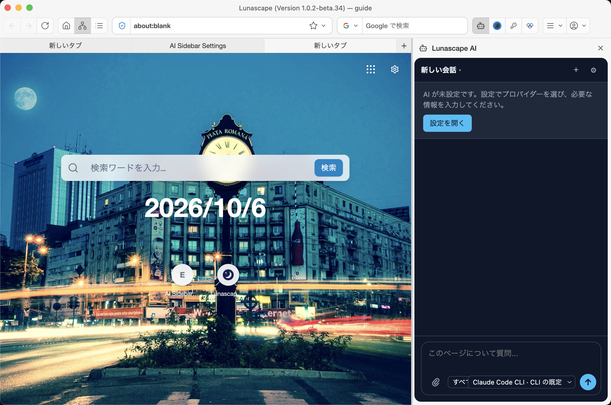
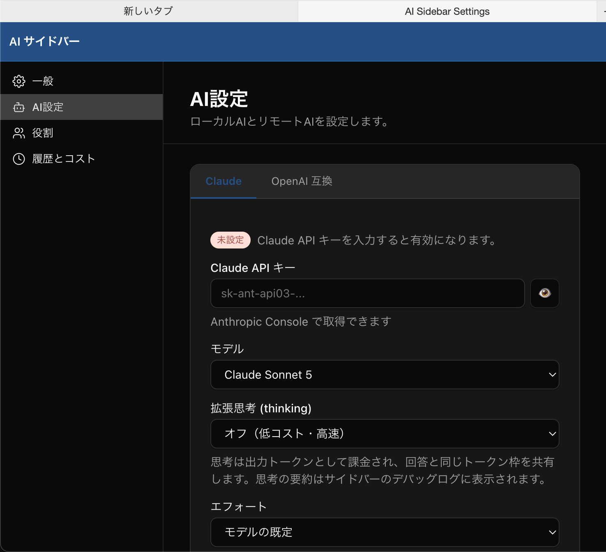

---
navigation:
  order: 100
---

# Lunascape AI

Lunascape AI は、ブラウザーに内蔵の AI アシスタントです。表示中のページについて質問したり、タブやブックマークの操作を任せたりできます。使うには、AI のプロバイダー（Claude の API キーなど）を設定します。

## 使える場所

| 場所 | 開きかた | できること |
| --- | --- | --- |
| ページチャット | ツールバー右のロボットのアイコン | 表示中のページについて質問します。ウィンドウの右側にパネルが開きます |
| エージェント | ツールバー左のロボットのアイコン、またはサイドバーの **エージェント** | 画面いっぱいで AI と会話し、作業を任せます。右側に AI が使っているタブが表示されます |

## はじめに設定する

AI がまだ設定されていないと、パネルに「AI が未設定です」と表示されます。

1. パネルの **設定を開く** を押します。**AI サイドバー** の設定画面が新しいタブで開きます。
2. **AI設定** を開き、**Claude** か **OpenAI 互換** のタブを選びます。
3. API キーを入力し、モデルを選んで **保存** を押します。Claude の API キーは Anthropic Console で取得できます。
4. **一般** の **AI プロバイダー** で、設定したプロバイダーを選びます。

> **ご注意:** AI の利用料は、API キーを発行したサービスから請求されます。**履歴とコスト** で、これまでの利用状況を確認できます。

## 質問する

1. ページを開いた状態で、ツールバー右のロボットのアイコンを押します。
2. 入力欄に質問を書いて送信します。

入力欄の左下で、AI に読ませるタブ（**すべてのタブ** など）を選べます。右下では、この会話で使うプロバイダーとモデルを切り替えられます。

## AI に許す操作を選ぶ

AI がブラウザーで何をしてよいかは、**設定** > **AI連携** の **ツール権限** タブで項目ごとに選びます。初期状態では、ページを操作する（クリック・入力など）権限、ダウンロードしたファイルに関する権限、デバッグデータの読み取りはオフです。

AI サイドバーの設定画面の **一般** にある **確認の頻度** で、AI が操作する前に確認を求める範囲も選べます。読むだけの操作は確認しません。ダウンロードしたファイルを開く操作は、常に確認します。

## オフにする

**設定** > **拡張機能** の **システム拡張** で **Lunascape AI** をオフにすると、ページチャット、エージェント、ツールバーのボタンがすべて消えます。

## 関連項目

- [外部の AI と連携する（MCP）](../../settings/ai-integration.md)
- [画面各部の名称](../../getting-started/screen.md)
