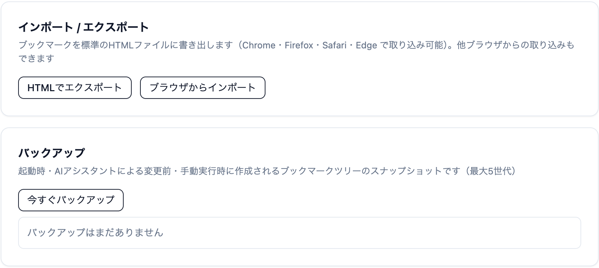

---
navigation:
  order: 500
---

# ブックマーク

## 追加する

- アドレスバー右の星アイコンを押します。
- タブをブックマークバーへドラッグしても追加できます。

## ブックマークバー

よく使うブックマークを、ツールバーの下に並べて表示します。

- 表示・非表示: **設定** > **外観** の **ブックマークバーを表示する**、またはメニューバーの **表示** > **ブックマークバーを表示する**
- アイコンの表示: **設定** > **外観** の **ブックマークバーにアイコンを表示する**
- ブックマークバーが空のときは、タブをバーへドラッグすると置けます。

## ブックマークマネージャ

メニュー（≡）から **ブックマークマネージャ** を開くと、フォルダー単位でまとめて整理できます。

- フォルダーの作成、名前の変更、削除
- ドラッグでの並べ替えと移動
- 右クリックから **新しいタブで開く** / **新しいウィンドウで開く**
- 他のブラウザーからの[インポート](../../getting-started/import.md)と、HTML への書き出し

## 書き出す

**設定** > **ブックマーク** の **HTMLでエクスポート** で、ブックマークを HTML ファイルに書き出せます。Chrome・Firefox・Safari・Edge で取り込める形式です。

## バックアップから戻す

ブックマーク全体のバックアップが、次のときに自動で作られます。直近の 5 件まで残ります。

- Lunascape の起動時
- AI（Lunascape AI や MCP でつないだ外部の AI）がブックマークを変更する前
- **今すぐバックアップ** を押したとき（前回から変更がなければ作られません）

戻すときは、**設定** > **ブックマーク** の **バックアップ** の一覧から選んで **復元** を押します。

## 関連項目

- [データの移行](../../getting-started/import.md)
- [履歴](history.md)
