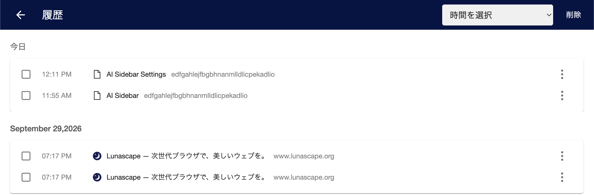

---
navigation:
  order: 600
---

# 履歴

## 履歴を見る

メニュー（≡）の **履歴**、またはメニューバーの **履歴** > **履歴** を選びます。今日・昨日・日付ごとに、開いたページが新しい順に並びます。

各行の右の **︙** から、次の操作ができます。

- **履歴から削除**: その行を削除します。
- **このサイトの他のページ**: 同じサイトの履歴だけを表示します。

## 履歴を削除する

- **選んで削除する**: 消したい行の左のチェックボックスに印を付け、右上の **削除** を押します。
- **期間を指定して削除する**: 右上の **時間を選択** から期間を選び、**削除** を押します。過去 1 時間・8 時間・1 日・7 日・1 か月と、**すべての履歴を削除** から選べます。

## 保存期間を変える

**設定** > **プライバシー** の **履歴保存日数** で、履歴を保持する日数を設定できます。初期値は 365 日です。期間を過ぎた履歴は自動的に削除されます。

> **注意:** シークレットウィンドウで開いたページは履歴に残りません。

## 関連項目

- [シークレットウィンドウ](../windows/private-window.md)
- [サイトデータ](../privacy/site-data.md)
