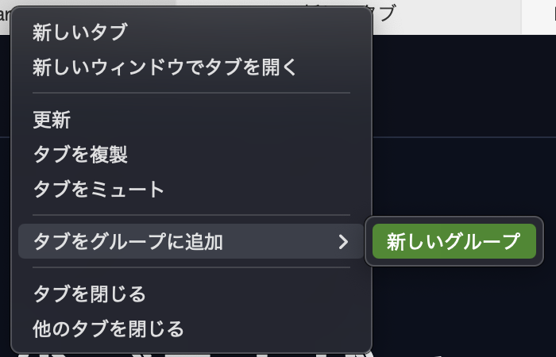
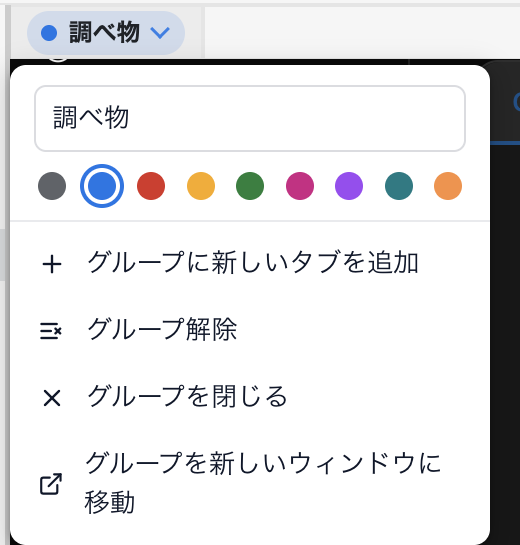
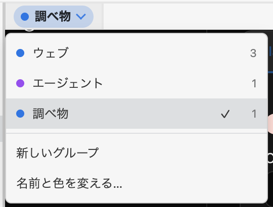

---
navigation:
  order: 300
---

# タブグループ

関連するタブをまとめて、色と名前を付けて管理できます。調べ物や作業の単位でタブを分けたいときに使います。

タブバーには、いま選んでいるグループのタブだけが並びます。ほかのグループのタブは、グループを切り替えると表示されます。初めから、ふだんのタブの **ウェブ** と、Lunascape AI が使う **エージェント** のグループがあります。

## グループを作る

1. まとめたいタブを右クリックします。
2. **タブをグループに追加** > **新しいグループ** を選びます。

   

3. タブバーの左端にグループ名（初めは **名称未設定のグループ**）が表示されます。グループ名を押して **名前と色を変える…** を選び、名前と色を設定します。

   

左のサイドバーの **タブグループ** の **+** からも、新しいグループを作れます。

すでにあるグループに加えるときは、タブを右クリックして **タブをグループに追加** から対象のグループを選びます。

## グループを切り替える

タブバー左端のグループ名を押すと、グループの一覧が表示されます。切り替えたいグループを選びます。左のサイドバーの **タブグループ** からも切り替えられます。

## グループを操作する

グループ名を押して **名前と色を変える…** を選ぶと、次の操作もできます。

| 操作 | 説明 |
| --- | --- |
| グループに新しいタブを追加 | グループの中に新しいタブを開きます |
| グループ解除 | グループを解除します。タブはそのまま残ります |
| グループを閉じる | グループ内のタブをまとめて閉じます |
| グループを新しいウィンドウに移動 | グループごと別ウィンドウへ移します |

## グループから外す

タブを右クリックして **タブをグループから削除** を選びます。タブは閉じずにグループの外へ出ます。

## 関連項目

- [タブを操作する](tabs.md)
- [Lunascape AI](../ai/lunascape-ai.md)
