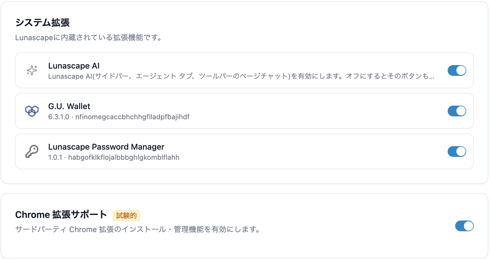

---
navigation:
  order: 100
---

# 拡張機能を追加・管理する

Lunascape は Chrome 拡張機能に対応しています。Chrome ウェブストアから追加できます。

## 最初に Chrome 拡張サポートをオンにする

Chrome ウェブストアの拡張機能を追加するには、**設定** > **拡張機能** の **Chrome 拡張サポート** をオンにします。試験的な機能のため、初めはオフになっていることがあります。

オフのまま追加しようとすると、「拡張機能を追加できません」と表示されます。

## 追加する

1. Chrome ウェブストアで使いたい拡張機能のページを開きます。
2. **Chrome に追加** を押します。
3. **拡張機能のインストール** の画面に、拡張機能が必要とする権限が表示されます。内容を確認して **インストール** を押します。

権限には、次のようなものがあります。

| 表示 | 意味 |
| --- | --- |
| 閲覧アクティビティの読み取り | 開いているタブの情報を読み取ります |
| 閲覧履歴の読み取りと変更 | 履歴を読み書きします |
| ブックマークの読み取りと変更 | ブックマークを読み書きします |
| Cookieの読み取りと変更 | サイトのログイン状態などを読み書きします |
| ダウンロードの管理 | ダウンロードを操作します |
| アクセスしたウェブサイト上のすべてのデータの読み取りと変更 | 開いたページの内容を読み書きします |

> **注意:** 一部の拡張機能は、Lunascape が未対応の API を使うためインストールできません。その場合は **非対応の拡張機能** と表示され、必要な API が示されます。

あとから拡張機能が追加の権限を求めることもあります。そのときは **追加の権限を許可しますか？** と表示されるので、**許可する** か **許可しない** を選びます。

## 管理する

**設定** > **拡張機能** の **インストール済み拡張機能** で、追加した拡張機能のオン・オフと **削除** ができます。パソコン上のファイルを開いたページでも動かしたい拡張機能は、**ファイルの URL へのアクセスを許可する** にチェックを入れます。

拡張機能のボタンはツールバーに並びます。ボタンを押すとポップアップが開きます。

## 内蔵の拡張機能

次の拡張機能は Lunascape に内蔵されています。**設定** > **拡張機能** の **システム拡張** で、個別にオフにできます。

| 名前 | 説明 |
| --- | --- |
| Lunascape AI | [Lunascape AI](../ai/lunascape-ai.md) |
| G.U. Wallet | [G.U. Wallet](wallet.md) |
| Lunascape Password Manager | [パスワードマネージャー](password-manager.md) |

## 関連項目

- [うまく動かない拡張機能がある](../../troubleshooting/extensions.md)
