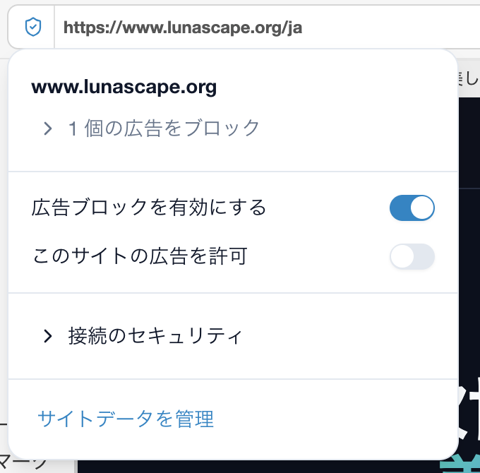

---
navigation:
  order: 300
---

# サイトデータと閲覧データ

## サイトごとのデータを見る・消す

アドレスバー左端の盾のアイコンを押し、パネルの一番下にある **サイトデータを管理** を開くと、そのサイトが保存している Cookie などのデータを確認して削除できます。削除すると、そのサイトからはログアウトされることがあります。

## 履歴の保存日数

**設定** > **プライバシー** の **履歴保存日数** で、閲覧履歴を保持する日数を設定します。

## まとめて削除する

**設定** > **プライバシー** から、閲覧履歴・Cookie・キャッシュなどをまとめて削除できます。プロファイルごとに独立しているため、削除の対象は現在のプロファイルです。

## 関連項目

- [履歴](../browser/history.md)
- [プロファイル](../windows/profiles.md)
