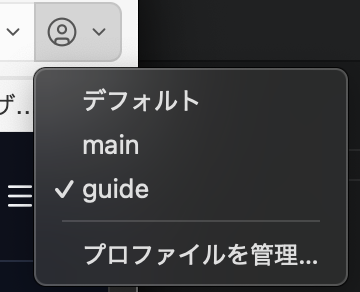
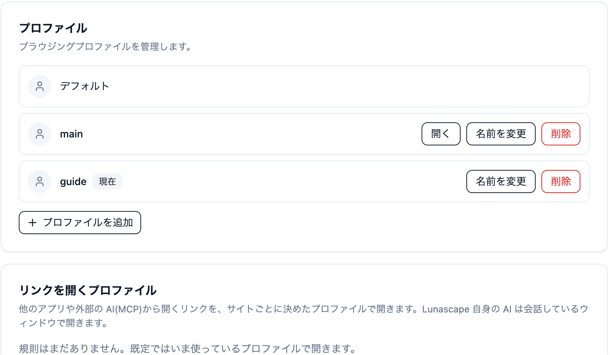

---
navigation:
  order: 200
---

# プロファイル

プロファイルを分けると、ブックマーク・履歴・Cookie・拡張機能の状態を別々に持てます。仕事用と個人用を切り替えたいときに使います。

## プロファイルを追加する

1. ツールバー右端の人型のアイコンを押し、**プロファイルを管理…** を選びます。

   

2. 設定の **プロファイル** 画面が開きます。**プロファイルを追加** を押します。
3. プロファイル名を入力して `Enter` を押します。同じ名前は使えません。

## 切り替える

人型のアイコンの一覧からプロファイルを選ぶか、設定の **プロファイル** 画面で **開く** を押すと、そのプロファイルのウィンドウが開きます。ウィンドウごとにプロファイルが決まり、タイトルバーにプロファイル名が表示されます。

## 削除する

設定の **プロファイル** 画面で **削除** を押します。**このプロファイルの閲覧データはこの端末から完全に削除されます。** 取り消せないため、必要なブックマークは先に書き出してください。

> **注意:** パスワードマネージャーに保存したパスワードは、すべてのプロファイルで共有されます。

## サイトごとに開くプロファイルを決める

他のアプリや外部の AI（MCP）から開いたリンクは、ふだんはいま使っているプロファイルで開きます。特定のサイトを決まったプロファイルで開きたいときは、規則を追加します。

1. **設定** > **プロファイル** の **リンクを開くプロファイル** を開きます。
2. サイトのホスト名（例: `figma.com`）を入力し、開くプロファイルを選んで **追加** を押します。

Lunascape AI が開くリンクは、この規則によらず、AI と会話しているウィンドウで開きます。

## 関連項目

- [データの移行](../../getting-started/import.md)
- [パスワードマネージャー](../extensions/password-manager.md)
