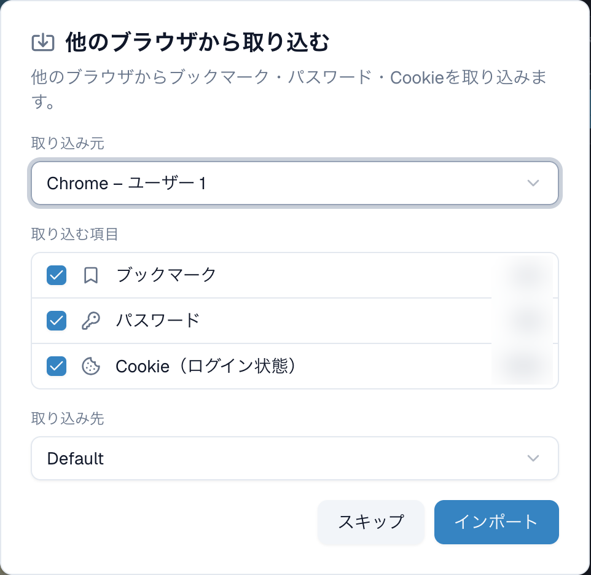

---
navigation:
  order: 300
---

# 他のブラウザーからデータを移行する

Chrome などのブラウザーから、ブックマーク・パスワード・Cookie（ログイン状態）を取り込めます。

## 取り込む

1. **設定** > **ブックマーク** の **ブラウザからインポート** を押します。`Ctrl+I` / `Cmd+I` でも開けます。
2. **他のブラウザから取り込む** の画面で、**取り込み元** のブラウザーとプロファイルを選びます。
3. **取り込む項目** で、取り込むものにチェックを入れます。項目の右に件数が表示されます。
4. **取り込み先** で、Lunascape のどのプロファイルに取り込むかを選びます。**新規プロファイル** を選ぶと、新しいプロファイルを作って取り込めます。
5. **インポート** を押します。

> **注意:**
>
> - 取り込む前に、取り込み元のブラウザーを閉じておいてください。
> - パスワードはプロファイルごとではなく、すべてのプロファイルで共有されます。

## 取り込めるもの

| 項目 | 説明 |
| --- | --- |
| ブックマーク | フォルダー構成のまま取り込みます |
| パスワード | 保存済みのログイン情報を取り込みます |
| Cookie（ログイン状態） | サイトにログインしたままの状態を引き継ぎます |

取り込み元のブラウザーによっては、ブックマークしか取り込めないことがあります。

## 取り込めないとき

- **Cookie**: 新しいバージョンの Chrome は、Cookie を他のアプリから読み取れないように保護しています。この場合 Cookie は取り込めません。
- **パスワード**: Chrome の保存済みパスワードを復号できなかったときは、取り込めなかったことが表示されます。設定から取り込みをやり直せます。
- **このパソコンで他のブラウザが見つかりませんでした。**: 取り込み元のブラウザーがこのパソコンにインストールされていません。

## 関連項目

- [ブックマーク](../features/browser/bookmarks.md)
- [プロファイル](../features/windows/profiles.md)
