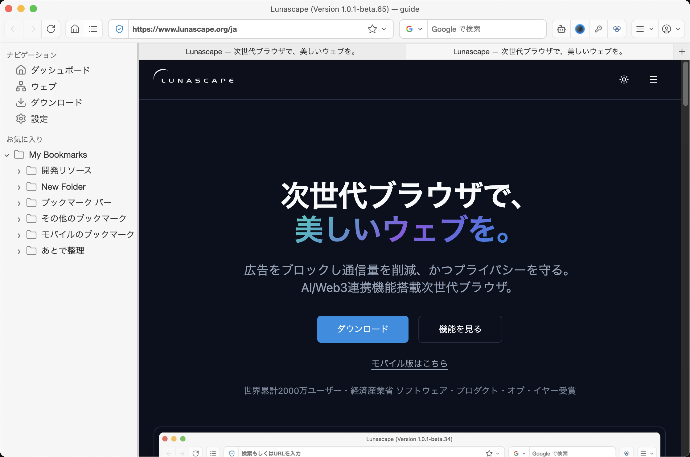

---
navigation:
  order: 200
---

# 画面各部の名称

Lunascape のウィンドウは、次の要素で構成されています。

| 名称 | 説明 |
| --- | --- |
| ツールバー | ウィンドウの一番上です。戻る／進む／再読み込み、アドレスバー、検索バー、各種ボタンが並びます |
| アドレスバー | URL の入力と、検索キーワードの入力を兼ねます。左端の盾のアイコンから、広告ブロックとサイトデータを操作できます |
| 検索バー | 検索エンジンを選んで検索します。ツールバーに表示するかどうかは設定で変更できます |
| サイドバー | ウィンドウの左側です。ダッシュボード・ウェブ・ダウンロード・設定への移動と、お気に入り（ブックマーク）が並びます |
| タブバー | ページ領域のすぐ上に、開いているタブが並びます。右端の **+** で新しいタブを開きます。ドラッグで並べ替え、ウィンドウ外へ引き出して分離できます |
| ブックマークバー | よく使うブックマークが並びます。表示・非表示を切り替えられます |
| サイドパネル | ウィンドウの右側に、AI サイドバーや G.U. Wallet などのパネルを表示します |
| ページ領域 | Web ページを表示します |

## ツールバーの主なボタン

- **ダッシュボード**（家のアイコン）: 新しいタブのダッシュボードを開きます。表示するかどうかは **設定** > **外観** で変更できます。
- **サイドバー**（リストのアイコン）: 左のサイドバーを表示・非表示にします。
- **AI サイドバー**（ロボットのアイコン）: 表示中のページについて AI に質問できるパネルを右側に開きます。
- **パスワードマネージャー**（鍵のアイコン）: 保存したログイン情報を開きます。
- **G.U. Wallet**: ウォレットのパネルを右側に開きます。
- **拡張機能**: インストール済み拡張機能のボタンが並びます。
- **メニュー（≡）**: ブックマーク、履歴、ダウンロード、設定などをまとめて開きます。
- **プロファイル**（人型のアイコン）: プロファイルを切り替えたり、管理画面を開いたりします。

## ダッシュボード

新しいタブを開くとダッシュボードが表示されます。検索ボックス、よく使うサイト、背景画像で構成されています。背景は **設定** > **テーマ** の **ダッシュボード背景** から変更できます。

## 関連項目

- [タブを操作する](../features/browser/tabs.md)
- [設定一覧](../settings/overview.md)
