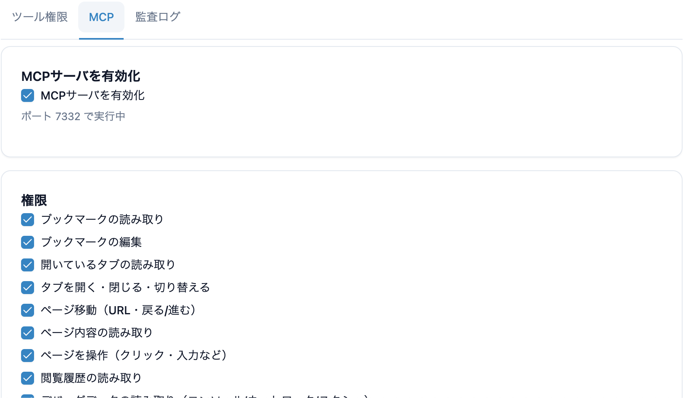
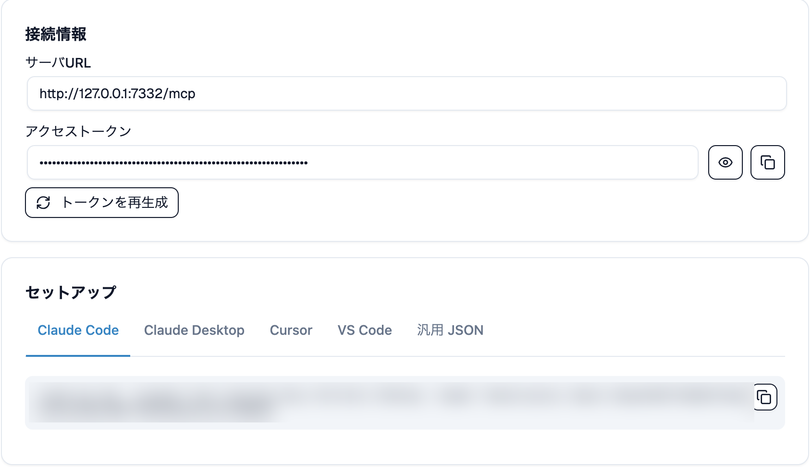

---
navigation:
  order: 200
---

# 外部の AI と連携する（MCP）

**設定** > **AI連携** では、MCP サーバーを通じて外部の AI アシスタントから Lunascape を操作させられます。Claude Code、Claude Desktop、Cursor、VS Code など MCP に対応した AI クライアントが、いつも使っているタブやログイン状態のまま、ページを読んだり操作したりできます。拡張機能を追加する必要はありません。

**AI連携** の画面は、**ツール権限**・**MCP**・**監査ログ** の 3 つのタブに分かれています。MCP サーバーの設定は **MCP** タブにあります。**ツール権限** タブは、Lunascape に内蔵の [Lunascape AI](../features/ai/lunascape-ai.md) に許可する操作の設定で、MCP の権限とは別です。

## 有効にする

**MCP** タブの **MCPサーバを有効化** をオンにすると、接続を待ち受けます。動作中はポート番号が表示されます。初期状態ではオフです。



## 渡す権限を選ぶ

AI に許可する操作を、**MCP** タブの **権限** で項目ごとに選べます。必要なものだけを有効にしてください。

| 権限 | できること |
| --- | --- |
| ブックマークの読み取り / 編集 | ブックマークを読む、追加・変更する |
| 開いているタブの読み取り | 開いているタブの一覧を読む |
| タブを開く・閉じる・切り替える | タブを操作する |
| ページ移動（URL・戻る/進む） | 指定した URL へ移動する |
| ページ内容の読み取り | 表示中のページの内容を読む |
| ページを操作（クリック・入力など） | ページ上の要素を操作する |
| 閲覧履歴の読み取り | 履歴を読む |
| ダウンロードしたファイルの読み取り | ダウンロード済みファイルの内容を読む |
| ダウンロードしたファイルを開く | 既定のアプリでファイルを開く（実行のたびに確認が表示されます） |
| デバッグデータの読み取り | ページのコンソール出力、ネットワーク通信、スクリーンショットを読む |
| Lunascape Docs の文書の読み取りと検索 | Lunascape Docs で開いている文書を読む、検索する |
| Lunascape Docs の文書への変更の提案 | 文書の変更を提案する（保存するかどうかはあなたが決めます） |

**file:// リクエストも記録する** をオンにすると、デバッグデータのネットワーク通信に、パソコン上のファイル（`file://`）の読み込みも含めます。

> **注意:** ファイルを開く操作は、実行のたびに確認画面が表示されます。自分で依頼した操作かどうかを確かめてから許可してください。

## AI クライアントとつなぐ

**接続情報** に、接続先の **サーバURL** と **アクセストークン** が表示されます。**セットアップ** で使っている AI クライアントを選ぶと、そのまま貼り付けられる設定が表示されます。コピーして AI クライアント側に追加してください。



| AI クライアント | 追加する場所 |
| --- | --- |
| Claude Code | 表示されたコマンドをターミナルで実行する |
| Claude Desktop | 設定ファイルに追記する（Node.js の `npx` が必要です） |
| Cursor | `~/.cursor/mcp.json` に追記する |
| VS Code | プロジェクトの `.vscode/mcp.json` に追記する |
| そのほか | **汎用 JSON** を、その AI クライアントの MCP 設定に追記する |

Claude Code の場合は、次のようなコマンドになります。URL とトークンは画面に表示された値を使ってください。

```sh
claude mcp add --transport http lunascape http://127.0.0.1:7332/mcp --header "Authorization: Bearer <アクセストークン>"
```

> **注意:** アクセストークンは Lunascape を操作するための鍵です。人に教えたり、公開の場所に貼ったりしないでください。漏れたと思ったら **トークンを再生成** を押すと、それまでのトークンは使えなくなります。その後、AI クライアント側の設定も貼り直してください。

## 何をしたかを確かめる

**監査ログ** には、AI が呼んだ操作が、依頼の内容と結果とともに記録されます。**保存件数** で残す件数を変えられ、**CSVエクスポート** で書き出せます。

## ブックマークを元に戻す

AI がブックマークを変更する前に、ブックマーク全体が自動でバックアップされます。戻しかたは[ブックマーク](../features/browser/bookmarks.md#バックアップから戻す)を参照してください。

## リンクを開くプロファイル

外部の AI が開いたリンクは、いま使っているプロファイルで開きます。サイトごとに開くプロファイルを決めたいときは、**設定** > **プロファイル** の **リンクを開くプロファイル** に規則を追加します。詳しくは[プロファイル](../features/windows/profiles.md)を参照してください。

## 安全のしくみ

- MCP サーバーは、お使いのコンピューターの中（`127.0.0.1`）からの接続だけを受け付けます。ほかのコンピューターからはつながりません
- すべての接続にアクセストークンが必要です
- AI にできるのは、許可した権限の範囲だけです

> **ヒント:** Lunascape から受け取った内容を AI クライアントがどう扱うかは、その AI クライアント次第です。多くの場合、AI のサービスに送られて回答の生成に使われます。見せたくないページを開いているときは、MCP サーバーをオフにするか、ページ内容の読み取りを許可しないでください。
