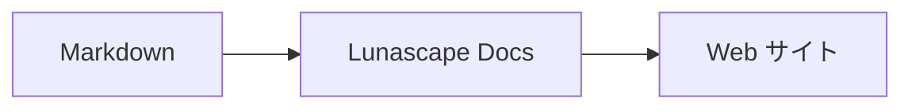

# 図やグラフを書く

コードブロックの言語名を指定するだけで、図やグラフとして描画されます。描画はすべて端末内で行い、外部のリソースは読み込みません。

## 対応している図

| 言語名 | 図 | 書きかた |
|---|---|---|
| `mermaid` | フローチャート、シーケンス図など | Mermaid の記法 |
| `vega-lite` | 棒グラフ、折れ線グラフなどのデータグラフ | Vega-Lite の JSON。データは `data.values` または `datasets` に埋め込みます |
| `markmap` | マインドマップ | Markdown の見出しと箇条書き |
| `wavedrom` | タイミング図 | WaveJSON（厳密な JSON） |
| `svgbob` | ASCII アートの構成図 | `+`、`-`、`>` や罫線文字を使ったテキスト図 |
| `tikz` | TikZ 図 | `tikzpicture` 環境を 1 つ。既存文書の `$$...$$` / `\[...\]` の中の `tikzpicture` も認識します |
| `penrose`（実験的） | 集合図 | 先頭に `@preset set-theory` を置き、`Set`、`Subset`、`Disjoint`、`Intersecting`、`AutoLabel All` だけで記述します |

### 例: Mermaid

````markdown

````

### 例: Vega-Lite

````markdown
```vega-lite
{
  "data": { "values": [ { "月": "4月", "件数": 12 }, { "月": "5月", "件数": 19 } ] },
  "mark": "bar",
  "encoding": {
    "x": { "field": "月", "type": "nominal" },
    "y": { "field": "件数", "type": "quantitative" }
  }
}
```
````

### 例: Svgbob

````markdown
```svgbob
+----------+      +----------+
| Markdown | ---> |   SVG    |
+----------+      +----------+
```
````

## 編集する

ビジュアル表示では、図は描画結果として表示されます。内容を変更するには、編集画面で [Markdown] を押してソースを編集します。ビジュアル表示で保存しても、図のソースはそのまま保持されます。

> **ご注意**
>
> - 各図の描画ライブラリは、その図が文書に含まれるときにだけ読み込まれます。
> - Vega-Lite で外部 URL のデータや画像マークは使えません。WaveDrom は厳密な JSON だけを受け付け、JavaScript 形式は使えません。
> - 生成された SVG は無害化されます。スクリプト、外部画像、外部スタイルへの参照を含む結果は表示されません。
> - **TikZ**: 配布版の拡張機能には描画エンジンが同梱されていないため、折りたたんだソースが表示されます。開発・評価目的では、信頼済みワークスペースの `node_modules/node-tikzjax`（1.0.5）を使う設定 `lunascapeDocEditor.tikz.runtime: "workspace"` を選べます。Web ブラウザ版では TikZ は描画されません。
> - **Penrose**: 試験的な機能です。記法は今後変わる可能性があります。

## 関連項目

- [数式を書く](math.md)
- [図・数式・画像が表示されない](../07-troubleshooting/rendering.md)
- [主な仕様](../08-reference/README.md)
