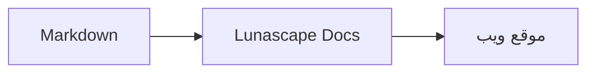

# كتابة الرسوم التخطيطية والمخططات

يكفي تحديد اسم اللغة في كتلة التعليمات البرمجية ليُرسم المحتوى كرسم تخطيطي أو مخطط. يجري الرسم كله داخل جهازك، ولا تُحمَّل أي موارد خارجية.

## الرسوم التخطيطية المدعومة

| اسم اللغة | الرسم التخطيطي | طريقة الكتابة |
|---|---|---|
| `mermaid` | مخططات انسيابية ومخططات تسلسل وغيرها | صياغة Mermaid |
| `vega-lite` | مخططات بيانات مثل المخططات الشريطية والخطية | JSON الخاص بـ Vega-Lite. ضمِّن البيانات في `data.values` أو `datasets` |
| `markmap` | خرائط ذهنية | عناوين Markdown وقوائمه النقطية |
| `wavedrom` | مخططات التوقيت | WaveJSON (JSON صارم) |
| `svgbob` | رسوم تركيبية بفن ASCII | رسوم نصية تستخدم `+` و`-` و`>` وأحرف رسم الإطارات |
| `tikz` | رسوم TikZ | بيئة `tikzpicture` واحدة. ويُتعرَّف أيضًا على `tikzpicture` داخل `$$...$$` / `\[...\]` في المستندات الموجودة |
| `penrose` (تجريبي) | رسوم المجموعات | ابدأ بـ `@preset set-theory` واستخدم `Set` و`Subset` و`Disjoint` و`Intersecting` و`AutoLabel All` فقط |

### مثال: Mermaid

````markdown

````

### مثال: Vega-Lite

````markdown
```vega-lite
{
  "data": { "values": [ { "الشهر": "أبريل", "العدد": 12 }, { "الشهر": "مايو", "العدد": 19 } ] },
  "mark": "bar",
  "encoding": {
    "x": { "field": "الشهر", "type": "nominal" },
    "y": { "field": "العدد", "type": "quantitative" }
  }
}
```
````

### مثال: Svgbob

````markdown
```svgbob
+----------+      +----------+
| Markdown | ---> |   SVG    |
+----------+      +----------+
```
````

## التحرير

في العرض المرئي تظهر الرسوم التخطيطية بنتيجتها المرسومة. لتغيير المحتوى، اضغط [Markdown] في شاشة التحرير وحرِّر المصدر. وعند الحفظ من العرض المرئي يبقى مصدر الرسم التخطيطي كما هو.

> **ملاحظة**
>
> - لا تُحمَّل مكتبة رسم كل نوع إلا عندما يحتوي المستند على ذلك النوع من الرسوم.
> - لا يمكن في Vega-Lite استخدام بيانات من عناوين URL خارجية ولا علامات الصور. ولا يقبل WaveDrom إلا JSON صارمًا، ولا يقبل صيغة JavaScript.
> - تُنقَّى ملفات SVG المولَّدة. ولا تُعرض النتائج التي تتضمن إشارات إلى نصوص برمجية أو صور خارجية أو أنماط خارجية.
> - **TikZ**: لا يتضمن الإصدار الموزَّع من الامتداد محرك رسم، لذلك يظهر المصدر مطويًا. ولأغراض التطوير والتقييم يمكنك اختيار الإعداد `lunascapeDocEditor.tikz.runtime: "workspace"` الذي يستخدم `node_modules/node-tikzjax` (1.0.5) في جذر مساحة عمل موثوقة. ولا يُرسم TikZ في إصدار متصفح الويب.
> - **Penrose**: ميزة تجريبية. وقد تتغير صياغتها لاحقًا.

## موضوعات ذات صلة

- [كتابة المعادلات](math.md)
- [الرسوم التخطيطية أو المعادلات أو الصور لا تظهر](../07-troubleshooting/rendering.md)
- [المواصفات الرئيسية](../08-reference/README.md)
