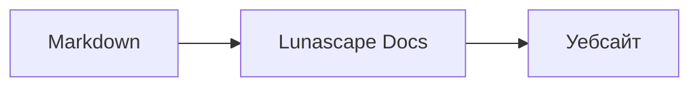

# Писане на диаграми и графики

Достатъчно е да зададете името на езика на блока с код, за да бъде изчертан като диаграма или графика. Цялото изчертаване се извършва на устройството и не се зареждат външни ресурси.

## Поддържани диаграми

| Име на езика | Диаграма | Как се пише |
|---|---|---|
| `mermaid` | Блок-схеми, секвенциални диаграми и други | Синтаксис на Mermaid |
| `vega-lite` | Графики с данни — стълбовидни, линейни и други | JSON на Vega-Lite. Данните се вграждат в `data.values` или `datasets` |
| `markmap` | Мисловни карти | Заглавия и списъци на Markdown |
| `wavedrom` | Времедиаграми | WaveJSON (строг JSON) |
| `svgbob` | Структурни диаграми с ASCII графика | Текстови рисунки със знаците `+`, `-`, `>` и знаците за чертане на рамки |
| `tikz` | Фигури на TikZ | Една среда `tikzpicture`. Разпознава се и `tikzpicture` в рамките на `$$...$$` / `\[...\]` в съществуващи документи |
| `penrose` (експериментално) | Диаграми на множества | Започнете с `@preset set-theory` и използвайте само `Set`, `Subset`, `Disjoint`, `Intersecting` и `AutoLabel All` |

### Пример: Mermaid

````markdown

````

### Пример: Vega-Lite

````markdown
```vega-lite
{
  "data": { "values": [ { "месец": "април", "брой": 12 }, { "месец": "май", "брой": 19 } ] },
  "mark": "bar",
  "encoding": {
    "x": { "field": "месец", "type": "nominal" },
    "y": { "field": "брой", "type": "quantitative" }
  }
}
```
````

### Пример: Svgbob

````markdown
```svgbob
+----------+      +----------+
| Markdown | ---> |   SVG    |
+----------+      +----------+
```
````

## Редактиране

Във визуалния изглед диаграмите се показват изчертани. За да промените съдържанието, натиснете [Markdown] в екрана за редактиране и редактирайте източника. Запазването от визуалния изглед оставя източника на диаграмата непроменен.

> **Забележка**
>
> - Библиотеката за изчертаване на всеки вид диаграма се зарежда само когато документът съдържа такава диаграма.
> - Vega-Lite не може да използва данни от външни URL адреси, нито знаци от тип изображение. WaveDrom приема само строг JSON, но не и формата на JavaScript.
> - Генерираният SVG се обезопасява. Резултат, който съдържа препратки към скриптове, външни изображения или външни стилове, не се показва.
> - **TikZ**: разпространяваното разширение не включва машина за изчертаване, затова се показва свитият източник. За целите на разработка и оценка може да изберете настройката `lunascapeDocEditor.tikz.runtime: "workspace"`, която използва `node_modules/node-tikzjax` (1.0.5) в надеждно работно пространство. Във версията за уеб браузър TikZ не се изчертава.
> - **Penrose**: експериментална функция. Синтаксисът може да се промени в бъдеще.

## Свързани теми

- [Писане на формули](math.md)
- [Диаграмите, формулите или изображенията не се показват](../07-troubleshooting/rendering.md)
- [Основни спецификации](../08-reference/README.md)
