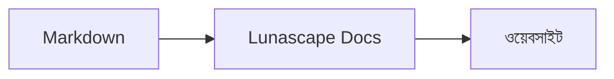

# চিত্র ও গ্রাফ লেখা

কোড ব্লকে ভাষার নাম উল্লেখ করলেই তা চিত্র বা গ্রাফ হিসেবে আঁকা হয়। সব আঁকার কাজ আপনার ডিভাইসেই হয়; কোনো বাইরের রিসোর্স লোড করা হয় না।

## সমর্থিত চিত্র

| ভাষার নাম | চিত্র | লেখার নিয়ম |
|---|---|---|
| `mermaid` | ফ্লোচার্ট, সিকোয়েন্স ডায়াগ্রাম ইত্যাদি | Mermaid-এর রীতি |
| `vega-lite` | বার চার্ট, লাইন চার্টের মতো ডেটা গ্রাফ | Vega-Lite-এর JSON। ডেটা `data.values` বা `datasets`-এ যুক্ত করুন |
| `markmap` | মাইন্ড ম্যাপ | Markdown-এর শিরোনাম ও তালিকা |
| `wavedrom` | টাইমিং ডায়াগ্রাম | WaveJSON (কঠোর JSON) |
| `svgbob` | ASCII আর্টের গঠনচিত্র | `+`, `-`, `>` ও বক্স-আঁকার অক্ষর দিয়ে তৈরি টেক্সট চিত্র |
| `tikz` | TikZ চিত্র | একটি `tikzpicture` এনভায়রনমেন্ট। বিদ্যমান নথিতে `$$...$$` / `\[...\]`-এর ভিতরের `tikzpicture`-ও শনাক্ত করা হয় |
| `penrose` (পরীক্ষামূলক) | সেট চিত্র | শুরুতে `@preset set-theory` রাখুন এবং কেবল `Set`, `Subset`, `Disjoint`, `Intersecting`, `AutoLabel All` ব্যবহার করে লিখুন |

### উদাহরণ: Mermaid

````markdown

````

### উদাহরণ: Vega-Lite

````markdown
```vega-lite
{
  "data": { "values": [ { "মাস": "এপ্রিল", "সংখ্যা": 12 }, { "মাস": "মে", "সংখ্যা": 19 } ] },
  "mark": "bar",
  "encoding": {
    "x": { "field": "মাস", "type": "nominal" },
    "y": { "field": "সংখ্যা", "type": "quantitative" }
  }
}
```
````

### উদাহরণ: Svgbob

````markdown
```svgbob
+----------+      +----------+
| Markdown | ---> |   SVG    |
+----------+      +----------+
```
````

## সম্পাদনা করা

ভিজ্যুয়াল প্রদর্শনে চিত্র আঁকা অবস্থাতেই দেখানো হয়। বিষয়বস্তু বদলাতে হলে সম্পাদনা পর্দায় [Markdown] চাপুন এবং সোর্স সম্পাদনা করুন। ভিজ্যুয়াল প্রদর্শন থেকে সংরক্ষণ করলেও চিত্রের সোর্স অপরিবর্তিত থাকে।

> **দ্রষ্টব্য**
>
> - প্রতিটি চিত্রের আঁকার লাইব্রেরি কেবল তখনই লোড হয়, যখন নথিতে সেই ধরনের চিত্র থাকে।
> - Vega-Lite-এ বাইরের URL-এর ডেটা বা ইমেজ মার্ক ব্যবহার করা যায় না। WaveDrom কেবল কঠোর JSON গ্রহণ করে, JavaScript রূপ নয়।
> - তৈরি হওয়া SVG নিরাপদ করা হয়। স্ক্রিপ্ট, বাইরের ছবি বা বাইরের স্টাইলের উল্লেখ থাকা ফলাফল দেখানো হয় না।
> - **TikZ**: বিতরণ করা এক্সটেনশনে আঁকার ইঞ্জিন অন্তর্ভুক্ত নেই, তাই ভাঁজ করা সোর্স দেখানো হয়। উন্নয়ন ও মূল্যায়নের উদ্দেশ্যে বিশ্বস্ত ওয়ার্কস্পেসের `node_modules/node-tikzjax` (1.0.5) ব্যবহার করার সেটিং `lunascapeDocEditor.tikz.runtime: "workspace"` বেছে নিতে পারেন। ওয়েব ব্রাউজার সংস্করণে TikZ আঁকা হয় না।
> - **Penrose**: এটি একটি পরীক্ষামূলক সুবিধা। এর রীতি ভবিষ্যতে বদলাতে পারে।

## সম্পর্কিত বিষয়

- [গাণিতিক সূত্র লেখা](math.md)
- [চিত্র, গাণিতিক সূত্র বা ছবি দেখা যাচ্ছে না](../07-troubleshooting/rendering.md)
- [প্রধান স্পেসিফিকেশন](../08-reference/README.md)
