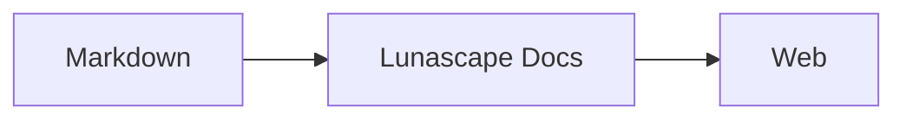

# Kreslení diagramů a grafů

Stačí u bloku kódu uvést správný název jazyka a vykreslí se jako diagram nebo graf. Veškeré vykreslování probíhá ve vašem zařízení; nenačítají se žádné externí zdroje.

## Podporované diagramy

| Název jazyka | Diagram | Jak jej napsat |
|---|---|---|
| `mermaid` | Vývojové diagramy, sekvenční diagramy a další | Zápis Mermaid |
| `vega-lite` | Datové grafy, například sloupcové a spojnicové | JSON pro Vega-Lite. Data vložte do `data.values` nebo `datasets` |
| `markmap` | Myšlenkové mapy | Nadpisy a odrážky v Markdownu |
| `wavedrom` | Časové diagramy | WaveJSON (striktní JSON) |
| `svgbob` | Strukturní diagramy v ASCII artu | Textové kresby využívající `+`, `-`, `>` a čárové znaky |
| `tikz` | Diagramy TikZ | Jedno prostředí `tikzpicture`. Rozpozná se i `tikzpicture` uvnitř `$$...$$` / `\[...\]` ve stávajících dokumentech |
| `penrose` (experimentální) | Množinové diagramy | Začněte řádkem `@preset set-theory` a používejte pouze `Set`, `Subset`, `Disjoint`, `Intersecting` a `AutoLabel All` |

### Příklad: Mermaid

````markdown

````

### Příklad: Vega-Lite

````markdown
```vega-lite
{
  "data": { "values": [ { "měsíc": "dub", "počet": 12 }, { "měsíc": "kvě", "počet": 19 } ] },
  "mark": "bar",
  "encoding": {
    "x": { "field": "měsíc", "type": "nominal" },
    "y": { "field": "počet", "type": "quantitative" }
  }
}
```
````

### Příklad: Svgbob

````markdown
```svgbob
+----------+      +----------+
| Markdown | ---> |   SVG    |
+----------+      +----------+
```
````

## Úpravy

Ve vizuálním zobrazení se diagramy zobrazují vykreslené. Chcete-li některý změnit, stiskněte v editoru [Markdown] a upravte zdroj. Uložení z vizuálního zobrazení zachová zdroj diagramu beze změny.

> **Poznámka**
>
> - Každá vykreslovací knihovna se načte pouze tehdy, když dokument obsahuje daný druh diagramu.
> - Vega-Lite nemůže používat externí datové URL ani obrázkové značky. WaveDrom přijímá pouze striktní JSON, nikoli formu JavaScriptu.
> - Vygenerované SVG se ošetří. Výstup, který odkazuje na skripty, externí obrázky nebo externí styly, se nezobrazí.
> - **TikZ**: distribuovaná verze rozšíření neobsahuje vykreslovací engine, proto se místo toho zobrazí sbalený zdroj. Pro vývoj a hodnocení nastavení `lunascapeDocEditor.tikz.runtime: "workspace"` použije `node_modules/node-tikzjax` (1.0.5) v kořeni důvěryhodného pracovního prostoru. Webový prohlížeč TikZ nevykresluje.
> - **Penrose**: experimentální funkce. Zápis se může změnit.

## Související témata

- [Psaní vzorců](math.md)
- [Diagramy, vzorce nebo obrázky se nevykreslují](../07-troubleshooting/rendering.md)
- [Hlavní specifikace](../08-reference/README.md)
