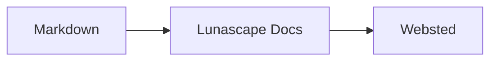

# Skriv diagrammer og grafer

Giv en kodeblok det rigtige sprognavn, så bliver den tegnet som et diagram eller en graf. Al optegning sker på din enhed; der indlæses ingen eksterne ressourcer.

## Understøttede diagrammer

| Sprognavn | Diagram | Sådan skriver du det |
|---|---|---|
| `mermaid` | Rutediagrammer, sekvensdiagrammer med mere | Mermaid-notation |
| `vega-lite` | Datagrafer som søjle- og kurvediagrammer | Vega-Lite-JSON. Læg data i `data.values` eller `datasets` |
| `markmap` | Tankekort | Overskrifter og punktopstillinger i Markdown |
| `wavedrom` | Timingdiagrammer | WaveJSON (streng JSON) |
| `svgbob` | Strukturdiagrammer i ASCII-kunst | Teksttegninger med `+`, `-`, `>` og stregtegn |
| `tikz` | TikZ-figurer | Ét `tikzpicture`-miljø. Et `tikzpicture` inde i `$$...$$` / `\[...\]` i eksisterende dokumenter genkendes også |
| `penrose` (eksperimentel) | Mængdediagrammer | Begynd med `@preset set-theory`, og brug kun `Set`, `Subset`, `Disjoint`, `Intersecting` og `AutoLabel All` |

### Eksempel: Mermaid

````markdown

````

### Eksempel: Vega-Lite

````markdown
```vega-lite
{
  "data": { "values": [ { "måned": "apr.", "antal": 12 }, { "måned": "maj", "antal": 19 } ] },
  "mark": "bar",
  "encoding": {
    "x": { "field": "måned", "type": "nominal" },
    "y": { "field": "antal", "type": "quantitative" }
  }
}
```
````

### Eksempel: Svgbob

````markdown
```svgbob
+----------+      +----------+
| Markdown | ---> |   SVG    |
+----------+      +----------+
```
````

## Rediger

I den visuelle visning vises diagrammer som færdigtegnede. Tryk på [Markdown] i redigeringsvisningen for at ændre kilden. Gemmer du fra den visuelle visning, bevares diagrammets kilde uændret.

> **Bemærk**
>
> - Hvert diagrams tegnebibliotek indlæses kun, når dokumentet indeholder den slags diagram.
> - Vega-Lite kan ikke bruge eksterne data-URL'er eller billedmærker. WaveDrom accepterer kun streng JSON, ikke JavaScript-formen.
> - Genereret SVG renses. Resultater, der henviser til scripts, eksterne billeder eller eksterne typografier, vises ikke.
> - **TikZ**: den distribuerede udvidelse indeholder ingen tegnemotor, så den sammenfoldede kilde vises i stedet. Til udvikling og evaluering kan du vælge indstillingen `lunascapeDocEditor.tikz.runtime: "workspace"`, som bruger `node_modules/node-tikzjax` (1.0.5) i roden af en browser, du har tillid til. Webvisningen tegner ikke TikZ.
> - **Penrose**: en eksperimentel funktion. Notationen kan ændre sig.

## Relaterede emner

- [Skriv matematik](math.md)
- [Diagrammer, matematik eller billeder vises ikke](../07-troubleshooting/rendering.md)
- [Vigtigste specifikationer](../08-reference/README.md)
