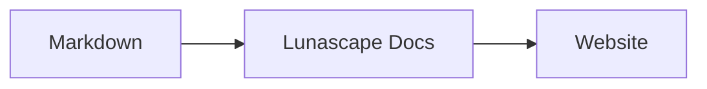

# Diagramme und Grafiken erstellen

Geben Sie einem Codeblock den passenden Sprachnamen, und er wird als Diagramm oder Grafik gerendert. Das Rendern erfolgt vollständig auf Ihrem Gerät; es werden keine externen Ressourcen geladen.

## Unterstützte Diagramme

| Sprachname | Diagramm | Schreibweise |
|---|---|---|
| `mermaid` | Flussdiagramme, Sequenzdiagramme und mehr | Mermaid-Syntax |
| `vega-lite` | Datengrafiken wie Balken- und Liniendiagramme | Vega-Lite-JSON. Die Daten werden in `data.values` oder `datasets` eingebettet |
| `markmap` | Mindmaps | Markdown-Überschriften und -Aufzählungen |
| `wavedrom` | Timing-Diagramme | WaveJSON (striktes JSON) |
| `svgbob` | Strukturdiagramme in ASCII-Art | Textzeichnungen mit `+`, `-`, `>` und Rahmenzeichen |
| `tikz` | TikZ-Diagramme | Eine `tikzpicture`-Umgebung. Ein `tikzpicture` innerhalb von `$$...$$` / `\[...\]` in bestehenden Dokumenten wird ebenfalls erkannt |
| `penrose` (experimentell) | Mengendiagramme | Beginnen Sie mit `@preset set-theory` und verwenden Sie nur `Set`, `Subset`, `Disjoint`, `Intersecting` und `AutoLabel All` |

### Beispiel: Mermaid

````markdown

````

### Beispiel: Vega-Lite

````markdown
```vega-lite
{
  "data": { "values": [ { "Monat": "Apr", "Anzahl": 12 }, { "Monat": "Mai", "Anzahl": 19 } ] },
  "mark": "bar",
  "encoding": {
    "x": { "field": "Monat", "type": "nominal" },
    "y": { "field": "Anzahl", "type": "quantitative" }
  }
}
```
````

### Beispiel: Svgbob

````markdown
```svgbob
+----------+      +----------+
| Markdown | ---> |   SVG    |
+----------+      +----------+
```
````

## Bearbeiten

In der visuellen Ansicht werden Diagramme als gerendertes Ergebnis angezeigt. Um eines zu ändern, drücken Sie im Editor [Markdown] und bearbeiten Sie den Quelltext. Beim Speichern aus der visuellen Ansicht bleibt der Diagramm-Quelltext unverändert.

> **Hinweis**
>
> - Jede Rendering-Bibliothek wird nur geladen, wenn das Dokument diese Art von Diagramm enthält.
> - Vega-Lite kann keine externen Daten-URLs oder Bildmarken verwenden. WaveDrom akzeptiert ausschließlich striktes JSON, nicht die JavaScript-Form.
> - Erzeugtes SVG wird bereinigt. Ausgaben, die auf Skripte, externe Bilder oder externe Stile verweisen, werden nicht angezeigt.
> - **TikZ**: Die verteilte Erweiterung enthält keine Rendering-Engine, daher wird stattdessen der eingeklappte Quelltext angezeigt. Für Entwicklung und Evaluierung verwendet die Einstellung `lunascapeDocEditor.tikz.runtime: "workspace"` das `node_modules/node-tikzjax` (1.0.5) im Stammverzeichnis eines vertrauenswürdigen Arbeitsbereichs. Der Web-Viewer rendert TikZ nicht.
> - **Penrose**: eine experimentelle Funktion. Die Syntax kann sich noch ändern.

## Verwandte Themen

- [Formeln schreiben](math.md)
- [Diagramme, Formeln oder Bilder werden nicht angezeigt](../07-troubleshooting/rendering.md)
- [Wichtige Spezifikationen](../08-reference/README.md)
