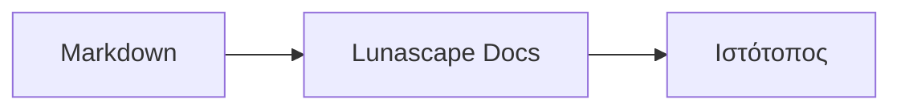

# Σχεδίαση διαγραμμάτων και γραφημάτων

Αρκεί να δηλώσετε το όνομα γλώσσας σε ένα μπλοκ κώδικα και αυτό αποδίδεται ως διάγραμμα ή γράφημα. Όλη η απόδοση γίνεται στη συσκευή σας· δεν φορτώνονται εξωτερικοί πόροι.

## Υποστηριζόμενα διαγράμματα

| Όνομα γλώσσας | Διάγραμμα | Τρόπος γραφής |
|---|---|---|
| `mermaid` | Διαγράμματα ροής, διαγράμματα ακολουθίας και άλλα | Σύνταξη Mermaid |
| `vega-lite` | Γραφήματα δεδομένων, όπως ραβδογράμματα και γραμμικά γραφήματα | JSON του Vega-Lite. Τα δεδομένα ενσωματώνονται στο `data.values` ή στο `datasets` |
| `markmap` | Νοητικοί χάρτες | Επικεφαλίδες και λίστες Markdown |
| `wavedrom` | Διαγράμματα χρονισμού | WaveJSON (αυστηρό JSON) |
| `svgbob` | Διαγράμματα δομής σε ASCII art | Σχέδια κειμένου με `+`, `-`, `>` και χαρακτήρες γραμμών |
| `tikz` | Σχήματα TikZ | Ένα περιβάλλον `tikzpicture`. Αναγνωρίζεται και ένα `tikzpicture` μέσα σε `$$...$$` / `\[...\]` σε υπάρχοντα έγγραφα |
| `penrose` (πειραματικό) | Διαγράμματα συνόλων | Ξεκινήστε με `@preset set-theory` και χρησιμοποιήστε μόνο τα `Set`, `Subset`, `Disjoint`, `Intersecting` και `AutoLabel All` |

### Παράδειγμα: Mermaid

````markdown

````

### Παράδειγμα: Vega-Lite

````markdown
```vega-lite
{
  "data": { "values": [ { "μήνας": "Απρ", "πλήθος": 12 }, { "μήνας": "Μάι", "πλήθος": 19 } ] },
  "mark": "bar",
  "encoding": {
    "x": { "field": "μήνας", "type": "nominal" },
    "y": { "field": "πλήθος", "type": "quantitative" }
  }
}
```
````

### Παράδειγμα: Svgbob

````markdown
```svgbob
+----------+      +----------+
| Markdown | ---> |   SVG    |
+----------+      +----------+
```
````

## Επεξεργασία

Στην οπτική προβολή, τα διαγράμματα εμφανίζονται αποδοσμένα. Για να αλλάξετε ένα διάγραμμα, πατήστε [Markdown] στην οθόνη επεξεργασίας και επεξεργαστείτε την πηγή. Η αποθήκευση από την οπτική προβολή διατηρεί την πηγή του διαγράμματος ως έχει.

> **Σημείωση**
>
> - Κάθε βιβλιοθήκη απόδοσης φορτώνεται μόνο όταν το έγγραφο περιέχει τον αντίστοιχο τύπο διαγράμματος.
> - Στο Vega-Lite δεν μπορούν να χρησιμοποιηθούν δεδομένα από εξωτερικές διευθύνσεις URL ούτε σημάνσεις εικόνας. Το WaveDrom δέχεται μόνο αυστηρό JSON, όχι τη μορφή JavaScript.
> - Το παραγόμενο SVG εξυγιαίνεται. Αποτελέσματα που περιέχουν αναφορές σε σενάρια, εξωτερικές εικόνες ή εξωτερικά στυλ δεν εμφανίζονται.
> - **TikZ**: η διανεμόμενη επέκταση δεν περιλαμβάνει μηχανή απόδοσης, οπότε εμφανίζεται η πηγή σε συμπτυγμένη μορφή. Για σκοπούς ανάπτυξης και αξιολόγησης, η ρύθμιση `lunascapeDocEditor.tikz.runtime: "workspace"` χρησιμοποιεί το `node_modules/node-tikzjax` (1.0.5) στη ρίζα ενός αξιόπιστου χώρου εργασίας. Η έκδοση για πρόγραμμα περιήγησης δεν αποδίδει TikZ.
> - **Penrose**: πειραματική λειτουργία. Η σύνταξη ενδέχεται να αλλάξει στο μέλλον.

## Σχετικά θέματα

- [Γραφή μαθηματικών](math.md)
- [Τα διαγράμματα, τα μαθηματικά ή οι εικόνες δεν εμφανίζονται](../07-troubleshooting/rendering.md)
- [Κύριες προδιαγραφές](../08-reference/README.md)
