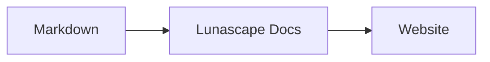

# Writing diagrams and charts

Give a code block the right language name and it is rendered as a diagram or chart. All rendering happens on your device; no external resources are loaded.

## Supported diagrams

| Language name | Diagram | How to write it |
|---|---|---|
| `mermaid` | Flowcharts, sequence diagrams and more | Mermaid syntax |
| `vega-lite` | Data charts such as bar and line charts | Vega-Lite JSON. Embed data in `data.values` or `datasets` |
| `markmap` | Mind maps | Markdown headings and lists |
| `wavedrom` | Timing diagrams | WaveJSON (strict JSON) |
| `svgbob` | ASCII-art structure diagrams | Text drawings using `+`, `-`, `>` and box-drawing characters |
| `tikz` | TikZ figures | One `tikzpicture` environment. A `tikzpicture` inside `$$...$$` / `\[...\]` in existing documents is recognized too |
| `penrose` (experimental) | Set diagrams | Start with `@preset set-theory` and use only `Set`, `Subset`, `Disjoint`, `Intersecting` and `AutoLabel All` |

### Example: Mermaid

````markdown

````

### Example: Vega-Lite

````markdown
```vega-lite
{
  "data": { "values": [ { "month": "Apr", "count": 12 }, { "month": "May", "count": 19 } ] },
  "mark": "bar",
  "encoding": {
    "x": { "field": "month", "type": "nominal" },
    "y": { "field": "count", "type": "quantitative" }
  }
}
```
````

### Example: Svgbob

````markdown
```svgbob
+----------+      +----------+
| Markdown | ---> |   SVG    |
+----------+      +----------+
```
````

## Edit

In the visual view, diagrams are shown rendered. To change one, press [Markdown] in the editor and edit the source. Saving from the visual view keeps the diagram source unchanged.

> **Note**
>
> - Each rendering library is loaded only when the document contains that kind of diagram.
> - Vega-Lite cannot use external data URLs or image marks. WaveDrom accepts strict JSON only, not the JavaScript form.
> - Generated SVG is sanitized. Output that references scripts, external images or external styles is not shown.
> - **TikZ**: the distributed extension does not bundle a rendering engine, so collapsed source is shown instead. For development and evaluation, the `lunascapeDocEditor.tikz.runtime: "workspace"` setting uses `node_modules/node-tikzjax` (1.0.5) at the root of a trusted workspace. The Web viewer does not render TikZ.
> - **Penrose**: an experimental feature. The syntax may change.

## Related topics

- [Writing math](math.md)
- [Diagrams, math or images do not render](../07-troubleshooting/rendering.md)
- [Specifications](../08-reference/README.md)
