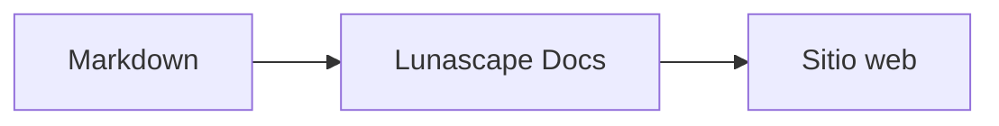

# Escribir diagramas y gráficos

Basta con indicar el nombre de lenguaje de un bloque de código para que se dibuje como un diagrama o un gráfico. Todo el dibujado se realiza dentro del dispositivo; no se cargan recursos externos.

## Diagramas compatibles

| Nombre de lenguaje | Diagrama | Cómo se escribe |
|---|---|---|
| `mermaid` | Diagramas de flujo, diagramas de secuencia, etc. | Sintaxis de Mermaid |
| `vega-lite` | Gráficos de datos como gráficos de barras o de líneas | JSON de Vega-Lite. Los datos se insertan en `data.values` o `datasets` |
| `markmap` | Mapas mentales | Encabezados y listas de Markdown |
| `wavedrom` | Diagramas de temporización | WaveJSON (JSON estricto) |
| `svgbob` | Diagramas de estructura en ASCII art | Dibujos de texto con `+`, `-`, `>` y caracteres de trazado de recuadros |
| `tikz` | Diagramas de TikZ | Un único entorno `tikzpicture`. También se reconoce un `tikzpicture` dentro de `$$...$$` / `\[...\]` en documentos existentes |
| `penrose` (experimental) | Diagramas de conjuntos | Empieza con `@preset set-theory` y usa solo `Set`, `Subset`, `Disjoint`, `Intersecting` y `AutoLabel All` |

### Ejemplo: Mermaid

````markdown

````

### Ejemplo: Vega-Lite

````markdown
```vega-lite
{
  "data": { "values": [ { "mes": "Abr", "cantidad": 12 }, { "mes": "May", "cantidad": 19 } ] },
  "mark": "bar",
  "encoding": {
    "x": { "field": "mes", "type": "nominal" },
    "y": { "field": "cantidad", "type": "quantitative" }
  }
}
```
````

### Ejemplo: Svgbob

````markdown
```svgbob
+----------+      +----------+
| Markdown | ---> |   SVG    |
+----------+      +----------+
```
````

## Editar

En la vista visual, los diagramas se muestran ya dibujados. Para cambiar uno, pulsa [Markdown] en la pantalla de edición y edita la fuente. Al guardar desde la vista visual, la fuente del diagrama se conserva sin cambios.

> **Nota**
>
> - La biblioteca de dibujado de cada diagrama se carga solo cuando el documento contiene ese tipo de diagrama.
> - En Vega-Lite no se pueden usar datos de URL externas ni marcas de imagen. WaveDrom solo acepta JSON estricto, no el formato JavaScript.
> - El SVG generado se sanea. No se muestra ningún resultado que contenga referencias a scripts, imágenes externas o estilos externos.
> - **TikZ**: la versión distribuida de la extensión no incluye un motor de dibujado, por lo que se muestra la fuente plegada. Para fines de desarrollo y evaluación, el ajuste `lunascapeDocEditor.tikz.runtime: "workspace"` usa `node_modules/node-tikzjax` (1.0.5) en la raíz de un área de trabajo de confianza. La versión para navegador web no dibuja TikZ.
> - **Penrose**: es una función experimental. La sintaxis puede cambiar en el futuro.

## Temas relacionados

- [Escribir fórmulas](math.md)
- [Los diagramas, las fórmulas o las imágenes no se muestran](../07-troubleshooting/rendering.md)
- [Especificaciones principales](../08-reference/README.md)
