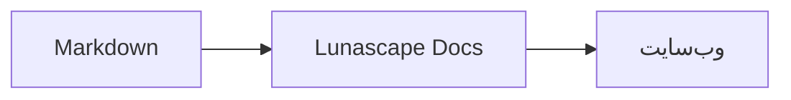

# نوشتن نمودار و گراف

کافی است نام زبان را برای یک بلوک کد مشخص کنید تا به صورت نمودار یا گراف رسم شود. تمام رسم‌ها درون دستگاه انجام می‌شود و هیچ منبع بیرونی بارگذاری نمی‌شود.

## نمودارهای پشتیبانی‌شده

| نام زبان | نمودار | شیوهٔ نوشتن |
|---|---|---|
| `mermaid` | فلوچارت، نمودار توالی و مانند آن | نحو Mermaid |
| `vega-lite` | گراف‌های داده مانند نمودار میله‌ای و خطی | JSON مربوط به Vega-Lite. داده‌ها را در `data.values` یا `datasets` جای دهید |
| `markmap` | نقشهٔ ذهنی | عنوان‌ها و فهرست‌های Markdown |
| `wavedrom` | نمودار زمان‌بندی | WaveJSON (JSON دقیق) |
| `svgbob` | نمودار ساختاری به شکل ASCII art | نمودار متنی با `+`، `-`، `>` و نویسه‌های خط‌کشی |
| `tikz` | نمودار TikZ | یک محیط `tikzpicture`. `tikzpicture` داخل `$$...$$` / `\[...\]` در اسناد موجود هم شناسایی می‌شود |
| `penrose` (آزمایشی) | نمودار مجموعه‌ها | در ابتدا `@preset set-theory` را قرار دهید و فقط از `Set`، `Subset`، `Disjoint`، `Intersecting` و `AutoLabel All` استفاده کنید |

### مثال: Mermaid

````markdown

````

### مثال: Vega-Lite

````markdown
```vega-lite
{
  "data": { "values": [ { "ماه": "آوریل", "تعداد": 12 }, { "ماه": "مه", "تعداد": 19 } ] },
  "mark": "bar",
  "encoding": {
    "x": { "field": "ماه", "type": "nominal" },
    "y": { "field": "تعداد", "type": "quantitative" }
  }
}
```
````

### مثال: Svgbob

````markdown
```svgbob
+----------+      +----------+
| Markdown | ---> |   SVG    |
+----------+      +----------+
```
````

## ویرایش

در نمای بصری، نمودارها به صورت رسم‌شده نمایش داده می‌شوند. برای تغییر محتوا، در صفحهٔ ویرایش [Markdown] را فشار دهید و کد منبع را ویرایش کنید. اگر در نمای بصری ذخیره کنید، منبع نمودار دست‌نخورده باقی می‌ماند.

> **توجه**
>
> - کتابخانهٔ رسم هر نمودار فقط زمانی بارگذاری می‌شود که آن نمودار در سند وجود داشته باشد.
> - در Vega-Lite نمی‌توان از داده‌های URL بیرونی یا نشانه‌های تصویری استفاده کرد. WaveDrom فقط JSON دقیق را می‌پذیرد و شکل JavaScript پذیرفته نمی‌شود.
> - SVG تولیدشده پاک‌سازی می‌شود. خروجی‌ای که به اسکریپت، تصویر بیرونی یا سبک بیرونی ارجاع دهد نمایش داده نمی‌شود.
> - **TikZ**: نسخهٔ توزیع‌شدهٔ افزونه موتور رسم را همراه ندارد، بنابراین کد منبع به شکل جمع‌شده نمایش داده می‌شود. برای مقاصد توسعه و ارزیابی می‌توانید تنظیم `lunascapeDocEditor.tikz.runtime: "workspace"` را انتخاب کنید که از `node_modules/node-tikzjax` (1.0.5) در فضای کاری مورد اعتماد استفاده می‌کند. در نسخهٔ مرورگر وب، TikZ رسم نمی‌شود.
> - **Penrose**: قابلیتی آزمایشی است. نحو آن ممکن است در آینده تغییر کند.

## موضوعات مرتبط

- [نوشتن فرمول ریاضی](math.md)
- [نمودار، فرمول ریاضی یا تصویر نمایش داده نمی‌شود](../07-troubleshooting/rendering.md)
- [مشخصات فنی اصلی](../08-reference/README.md)
