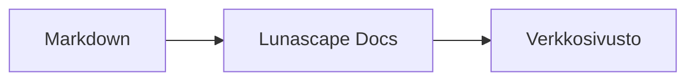

# Kaavioiden ja graafien kirjoittaminen

Kun annat koodilohkolle oikean kielen nimen, se piirretään kaaviona tai graafina. Kaikki piirtäminen tapahtuu laitteessasi, eikä ulkoisia resursseja ladata.

## Tuetut kaaviot

| Kielen nimi | Kaavio | Kirjoitustapa |
|---|---|---|
| `mermaid` | Vuokaaviot, sekvenssikaaviot ja muut | Mermaid-merkintätapa |
| `vega-lite` | Datagraafit, kuten pylväs- ja viivagraafit | Vega-Lite-JSON. Upota data kohtaan `data.values` tai `datasets` |
| `markmap` | Miellekartat | Markdown-otsikot ja luettelot |
| `wavedrom` | Ajoituskaaviot | WaveJSON (tiukka JSON) |
| `svgbob` | ASCII-taiteena piirretyt rakennekaaviot | Tekstikuvat, joissa käytetään merkkejä `+`, `-`, `>` ja viivanpiirtomerkkejä |
| `tikz` | TikZ-kuvat | Yksi `tikzpicture`-ympäristö. Myös olemassa olevien dokumenttien `$$...$$`- tai `\[...\]`-merkinnän sisällä oleva `tikzpicture` tunnistetaan |
| `penrose` (kokeellinen) | Joukkokaaviot | Aloita rivillä `@preset set-theory` ja käytä vain merkintöjä `Set`, `Subset`, `Disjoint`, `Intersecting` ja `AutoLabel All` |

### Esimerkki: Mermaid

````markdown

````

### Esimerkki: Vega-Lite

````markdown
```vega-lite
{
  "data": { "values": [ { "kuukausi": "huhti", "määrä": 12 }, { "kuukausi": "touko", "määrä": 19 } ] },
  "mark": "bar",
  "encoding": {
    "x": { "field": "kuukausi", "type": "nominal" },
    "y": { "field": "määrä", "type": "quantitative" }
  }
}
```
````

### Esimerkki: Svgbob

````markdown
```svgbob
+----------+      +----------+
| Markdown | ---> |   SVG    |
+----------+      +----------+
```
````

## Muokkaaminen

Visuaalisessa näkymässä kaaviot näkyvät piirrettyinä. Kun haluat muuttaa kaaviota, paina muokkausnäkymässä [Markdown] ja muokkaa lähdettä. Visuaalisesta näkymästä tallentaminen säilyttää kaavion lähteen ennallaan.

> **Huomautus**
>
> - Kunkin kaavion piirtokirjasto ladataan vain, kun dokumentti sisältää kyseisen kaavion.
> - Vega-Lite ei voi käyttää ulkoisia data-URL-osoitteita eikä kuvamerkintöjä. WaveDrom hyväksyy vain tiukan JSON-muodon, ei JavaScript-muotoa.
> - Muodostettu SVG puhdistetaan. Tulosta, joka viittaa komentosarjoihin, ulkoisiin kuviin tai ulkoisiin tyyleihin, ei näytetä.
> - **TikZ**: jaeltavassa laajennuksessa ei ole mukana piirtomoottoria, joten sen sijaan näytetään tiivistetty lähde. Kehitystä ja arviointia varten asetus `lunascapeDocEditor.tikz.runtime: "workspace"` käyttää luotetun työtilan juuressa olevaa hakemistoa `node_modules/node-tikzjax` (1.0.5). Verkkoselainversio ei piirrä TikZ-kuvia.
> - **Penrose**: kokeellinen ominaisuus. Merkintätapa voi muuttua.

## Aiheeseen liittyvää

- [Matematiikan kirjoittaminen](math.md)
- [Kaaviot, matematiikka tai kuvat eivät näy](../07-troubleshooting/rendering.md)
- [Määrittelyt](../08-reference/README.md)
