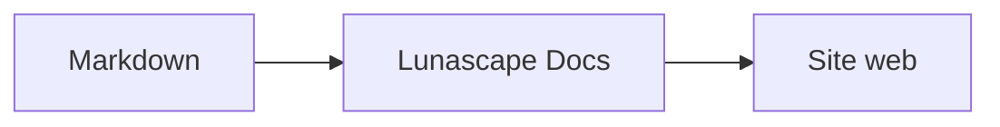

# Écrire des schémas et des graphiques

Il suffit d'indiquer le bon nom de langage sur un bloc de code pour qu'il soit rendu sous forme de schéma ou de graphique. Tout le rendu s'effectue sur votre appareil ; aucune ressource externe n'est chargée.

## Schémas pris en charge

| Nom de langage | Schéma | Comment l'écrire |
|---|---|---|
| `mermaid` | Organigrammes, diagrammes de séquence, etc. | Syntaxe Mermaid |
| `vega-lite` | Graphiques de données comme les diagrammes en barres et les courbes | JSON Vega-Lite. Intégrez les données dans `data.values` ou `datasets` |
| `markmap` | Cartes mentales | Titres et listes Markdown |
| `wavedrom` | Chronogrammes | WaveJSON (JSON strict) |
| `svgbob` | Schémas de structure en ASCII art | Dessins en texte utilisant `+`, `-`, `>` et les caractères de filet |
| `tikz` | Figures TikZ | Un seul environnement `tikzpicture`. Un `tikzpicture` à l'intérieur de `$$...$$` / `\[...\]` dans des documents existants est également reconnu |
| `penrose` (expérimental) | Schémas d'ensembles | Commencez par `@preset set-theory` et n'utilisez que `Set`, `Subset`, `Disjoint`, `Intersecting` et `AutoLabel All` |

### Exemple : Mermaid

````markdown

````

### Exemple : Vega-Lite

````markdown
```vega-lite
{
  "data": { "values": [ { "mois": "avril", "nombre": 12 }, { "mois": "mai", "nombre": 19 } ] },
  "mark": "bar",
  "encoding": {
    "x": { "field": "mois", "type": "nominal" },
    "y": { "field": "nombre", "type": "quantitative" }
  }
}
```
````

### Exemple : Svgbob

````markdown
```svgbob
+----------+      +----------+
| Markdown | ---> |   SVG    |
+----------+      +----------+
```
````

## Modifier

Dans l'affichage visuel, les schémas apparaissent sous leur forme rendue. Pour en modifier un, appuyez sur [Markdown] dans l'écran d'édition et modifiez la source. Un enregistrement depuis l'affichage visuel conserve la source du schéma telle quelle.

> **Remarque**
>
> - La bibliothèque de rendu de chaque schéma n'est chargée que lorsque le document contient ce type de schéma.
> - Vega-Lite ne peut pas utiliser d'URL de données externes ni de marques d'image. WaveDrom n'accepte que du JSON strict, pas la forme JavaScript.
> - Le SVG généré est désinfecté. Un résultat qui fait référence à des scripts, des images externes ou des styles externes n'est pas affiché.
> - **TikZ** : l'extension distribuée n'intègre pas de moteur de rendu ; la source repliée est donc affichée à la place. À des fins de développement et d'évaluation, le paramètre `lunascapeDocEditor.tikz.runtime: "workspace"` utilise `node_modules/node-tikzjax` (1.0.5) à la racine d'un espace de travail approuvé. La version pour navigateur web ne rend pas TikZ.
> - **Penrose** : fonctionnalité expérimentale. La syntaxe est susceptible de changer.

## Voir aussi

- [Écrire des formules](math.md)
- [Les schémas, formules ou images ne s'affichent pas](../07-troubleshooting/rendering.md)
- [Principales spécifications](../08-reference/README.md)
