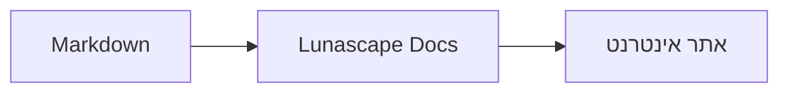

# כתיבת תרשימים וגרפים

די לציין את שם השפה בגוש קוד, והוא ייווצר כתרשים או כגרף. כל הציור מתבצע במכשיר עצמו, ללא טעינת משאבים חיצוניים.

## תרשימים נתמכים

| שם השפה | תרשים | אופן הכתיבה |
|---|---|---|
| `mermaid` | תרשימי זרימה, תרשימי רצף ועוד | תחביר Mermaid |
| `vega-lite` | גרפי נתונים כגון גרף עמודות וגרף קווים | JSON של Vega-Lite. את הנתונים משבצים ב-`data.values` או ב-`datasets` |
| `markmap` | מפות חשיבה | כותרות ורשימות של Markdown |
| `wavedrom` | תרשימי תזמון | WaveJSON (JSON קפדני) |
| `svgbob` | תרשימי מבנה באמנות ASCII | תרשימי טקסט בעזרת `+`, `-`, `>` ותווי מסגרת |
| `tikz` | תרשימי TikZ | סביבת `tikzpicture` אחת. גם `tikzpicture` בתוך `$$...$$` / `\[...\]` במסמכים קיימים מזוהה |
| `penrose` (ניסיוני) | תרשימי קבוצות | בתחילה יש להציב `@preset set-theory` ולכתוב רק בעזרת `Set`, `Subset`, `Disjoint`, `Intersecting` ו-`AutoLabel All` |

### דוגמה: Mermaid

````markdown

````

### דוגמה: Vega-Lite

````markdown
```vega-lite
{
  "data": { "values": [ { "חודש": "אפריל", "מספר": 12 }, { "חודש": "מאי", "מספר": 19 } ] },
  "mark": "bar",
  "encoding": {
    "x": { "field": "חודש", "type": "nominal" },
    "y": { "field": "מספר", "type": "quantitative" }
  }
}
```
````

### דוגמה: Svgbob

````markdown
```svgbob
+----------+      +----------+
| Markdown | ---> |   SVG    |
+----------+      +----------+
```
````

## עריכה

בתצוגה החזותית התרשימים מוצגים כתוצאת הציור. כדי לשנות את התוכן, לחצו על [Markdown] במסך העריכה וערכו את המקור. שמירה מתוך התצוגה החזותית משאירה את מקור התרשים כפי שהוא.

> **שימו לב**
>
> - ספריית הציור של כל תרשים נטענת רק כאשר אותו תרשים נכלל במסמך.
> - ב-Vega-Lite אי אפשר להשתמש בנתונים מכתובת URL חיצונית או בסימוני תמונה. WaveDrom מקבל JSON קפדני בלבד, ולא צורת JavaScript.
> - ה-SVG שנוצר עובר חיטוי. פלט המפנה לסקריפטים, לתמונות חיצוניות או לסגנונות חיצוניים אינו מוצג.
> - **TikZ**: בגרסת ההפצה של התוסף אין מנוע ציור מצורף, ולכן מוצג המקור המקופל. למטרות פיתוח והערכה אפשר לבחור בהגדרה `lunascapeDocEditor.tikz.runtime: "workspace"`, המשתמשת ב-`node_modules/node-tikzjax` (1.0.5) שבסביבת עבודה מהימנה. בגרסת דפדפן האינטרנט TikZ אינו מצויר.
> - **Penrose**: תכונה ניסיונית. התחביר עשוי להשתנות בהמשך.

## נושאים קשורים

- [כתיבת נוסחאות](math.md)
- [תרשימים, נוסחאות או תמונות אינם מוצגים](../07-troubleshooting/rendering.md)
- [מפרטים עיקריים](../08-reference/README.md)
