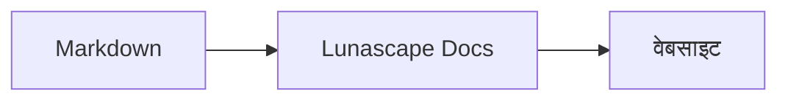

# आरेख और ग्राफ़ लिखना

कोड ब्लॉक में भाषा का नाम बताते ही वह आरेख या ग्राफ़ के रूप में प्रदर्शित हो जाता है। सारा रेंडरिंग आपके डिवाइस पर ही होता है; कोई बाहरी संसाधन लोड नहीं किया जाता।

## समर्थित आरेख

| भाषा का नाम | आरेख | लिखने का तरीका |
|---|---|---|
| `mermaid` | फ़्लोचार्ट, सीक्वेंस आरेख आदि | Mermaid का वाक्य-विन्यास |
| `vega-lite` | बार ग्राफ़, लाइन ग्राफ़ जैसे डेटा ग्राफ़ | Vega-Lite का JSON। डेटा को `data.values` या `datasets` में शामिल करें |
| `markmap` | माइंड मैप | Markdown के शीर्षक और सूचियाँ |
| `wavedrom` | टाइमिंग आरेख | WaveJSON (सख़्त JSON) |
| `svgbob` | ASCII आर्ट के संरचना आरेख | `+`, `-`, `>` और बॉक्स-रेखा वर्णों से बने टेक्स्ट आरेख |
| `tikz` | TikZ आरेख | एक `tikzpicture` परिवेश। मौजूदा दस्तावेज़ों में `$$...$$` / `\[...\]` के भीतर का `tikzpicture` भी पहचाना जाता है |
| `penrose` (प्रयोगात्मक) | समुच्चय आरेख | शुरुआत में `@preset set-theory` रखें और केवल `Set`, `Subset`, `Disjoint`, `Intersecting` तथा `AutoLabel All` का उपयोग करें |

### उदाहरण: Mermaid

````markdown

````

### उदाहरण: Vega-Lite

````markdown
```vega-lite
{
  "data": { "values": [ { "माह": "अप्रैल", "संख्या": 12 }, { "माह": "मई", "संख्या": 19 } ] },
  "mark": "bar",
  "encoding": {
    "x": { "field": "माह", "type": "nominal" },
    "y": { "field": "संख्या", "type": "quantitative" }
  }
}
```
````

### उदाहरण: Svgbob

````markdown
```svgbob
+----------+      +----------+
| Markdown | ---> |   SVG    |
+----------+      +----------+
```
````

## संपादित करना

दृश्य प्रदर्शन में आरेख रेंडर किए हुए रूप में दिखते हैं। सामग्री बदलने के लिए संपादन स्क्रीन पर [Markdown] दबाएँ और स्रोत संपादित करें। दृश्य प्रदर्शन से सहेजने पर भी आरेख का स्रोत ज्यों का त्यों बना रहता है।

> **ध्यान दें**
>
> - हर आरेख की रेंडरिंग लाइब्रेरी तभी लोड होती है, जब दस्तावेज़ में उस तरह का आरेख मौजूद हो।
> - Vega-Lite में बाहरी URL के डेटा या इमेज मार्क का उपयोग नहीं किया जा सकता। WaveDrom केवल सख़्त JSON स्वीकार करता है, JavaScript रूप नहीं।
> - बनाया गया SVG निरापद किया जाता है। जिस परिणाम में स्क्रिप्ट, बाहरी छवियों या बाहरी स्टाइल का संदर्भ हो, वह प्रदर्शित नहीं होता।
> - **TikZ**: वितरित एक्सटेंशन में रेंडरिंग इंजन शामिल नहीं है, इसलिए इसके बदले संक्षिप्त किया हुआ स्रोत दिखाया जाता है। विकास और मूल्यांकन के लिए `lunascapeDocEditor.tikz.runtime: "workspace"` सेटिंग चुनी जा सकती है, जो विश्वसनीय कार्यस्थान के `node_modules/node-tikzjax` (1.0.5) का उपयोग करती है। वेब ब्राउज़र संस्करण में TikZ रेंडर नहीं होता।
> - **Penrose**: यह एक प्रयोगात्मक सुविधा है। वाक्य-विन्यास आगे बदल सकता है।

## संबंधित विषय

- [गणितीय सूत्र लिखना](math.md)
- [आरेख, गणितीय सूत्र या छवियाँ प्रदर्शित नहीं होतीं](../07-troubleshooting/rendering.md)
- [मुख्य विनिर्देश](../08-reference/README.md)
