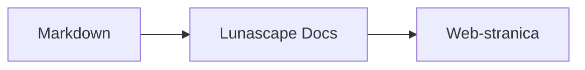

# Pisanje dijagrama i grafikona

Dovoljno je da kodnom bloku navedete naziv jezika i on se iscrtava kao dijagram ili grafikon. Sve iscrtavanje odvija se na vašem uređaju; vanjski se resursi ne učitavaju.

## Podržani dijagrami

| Naziv jezika | Dijagram | Kako se piše |
|---|---|---|
| `mermaid` | Dijagrami toka, sekvencijski dijagrami i slično | Mermaid sintaksa |
| `vega-lite` | Podatkovni grafikoni, primjerice stupčasti i linijski | Vega-Lite JSON. Podatke ugradite u `data.values` ili `datasets` |
| `markmap` | Mentalne mape | Markdown naslovi i natuknice |
| `wavedrom` | Vremenski dijagrami | WaveJSON (strogi JSON) |
| `svgbob` | Strukturni dijagrami u ASCII grafici | Tekstualni crteži sa znakovima `+`, `-`, `>` i znakovima za crtanje okvira |
| `tikz` | TikZ crteži | Jedno okruženje `tikzpicture`. Prepoznaje se i `tikzpicture` unutar `$$...$$` / `\[...\]` u postojećim dokumentima |
| `penrose` (eksperimentalno) | Dijagrami skupova | Na početak stavite `@preset set-theory` i pišite samo s pomoću `Set`, `Subset`, `Disjoint`, `Intersecting` i `AutoLabel All` |

### Primjer: Mermaid

````markdown

````

### Primjer: Vega-Lite

````markdown
```vega-lite
{
  "data": { "values": [ { "mjesec": "travanj", "broj": 12 }, { "mjesec": "svibanj", "broj": 19 } ] },
  "mark": "bar",
  "encoding": {
    "x": { "field": "mjesec", "type": "nominal" },
    "y": { "field": "broj", "type": "quantitative" }
  }
}
```
````

### Primjer: Svgbob

````markdown
```svgbob
+----------+      +----------+
| Markdown | ---> |   SVG    |
+----------+      +----------+
```
````

## Uređivanje

U vizualnom prikazu dijagrami su prikazani kao iscrtani rezultat. Da biste promijenili sadržaj, na zaslonu za uređivanje pritisnite [Markdown] i uredite izvorni kod. Spremanje u vizualnom prikazu ostavlja izvorni kod dijagrama nepromijenjenim.

> **Napomena**
>
> - Knjižnica za iscrtavanje pojedine vrste dijagrama učitava se samo kada dokument sadrži takav dijagram.
> - U Vega-Liteu nisu dostupni podaci s vanjskih URL-ova ni oznake sa slikama. WaveDrom prihvaća samo strogi JSON, a ne i JavaScript oblik.
> - Generirani SVG se pročišćava. Rezultat koji upućuje na skripte, vanjske slike ili vanjske stilove ne prikazuje se.
> - **TikZ**: distribuirano proširenje ne sadrži pogon za iscrtavanje, pa se prikazuje sklopljeni izvorni kod. Za razvoj i evaluaciju možete odabrati postavku `lunascapeDocEditor.tikz.runtime: "workspace"`, koja koristi `node_modules/node-tikzjax` (1.0.5) u pouzdanom radnom prostoru. U web-pregledniku se TikZ ne iscrtava.
> - **Penrose**: eksperimentalna značajka. Sintaksa se ubuduće može promijeniti.

## Povezane teme

- [Pisanje matematičkih izraza](math.md)
- [Dijagrami, matematički izrazi ili slike ne prikazuju se](../07-troubleshooting/rendering.md)
- [Glavne specifikacije](../08-reference/README.md)
