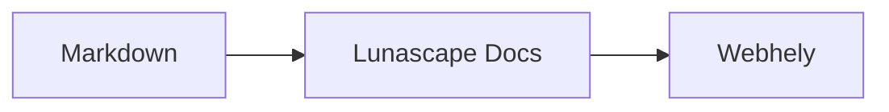

# Ábrák és grafikonok írása

Elég megadni a kódblokk nyelvének nevét, és a tartalom ábraként vagy grafikonként jelenik meg. A megjelenítés teljes egészében a készüléken történik, külső erőforrások betöltése nélkül.

## Támogatott ábrák

| Nyelv neve | Ábra | Hogyan írjuk |
|---|---|---|
| `mermaid` | Folyamatábrák, szekvenciadiagramok és egyebek | A Mermaid jelölésmódja |
| `vega-lite` | Adatgrafikonok, például oszlop- és vonaldiagramok | Vega-Lite JSON. Az adatokat a `data.values` vagy a `datasets` mezőbe ágyazza be |
| `markmap` | Gondolattérképek | Markdown-címsorok és felsorolások |
| `wavedrom` | Időzítési diagramok | WaveJSON (szigorú JSON) |
| `svgbob` | ASCII-rajzos szerkezeti ábrák | Szöveges rajzok a `+`, `-`, `>` és a keretrajzoló karakterek használatával |
| `tikz` | TikZ-ábrák | Egyetlen `tikzpicture` környezet. A meglévő dokumentumokban a `$$...$$` / `\[...\]` belsejében álló `tikzpicture` környezetet is felismeri |
| `penrose` (kísérleti) | Halmazábrák | Kezdje a `@preset set-theory` sorral, és csak a `Set`, `Subset`, `Disjoint`, `Intersecting` és `AutoLabel All` elemeket használja |

### Példa: Mermaid

````markdown

````

### Példa: Vega-Lite

````markdown
```vega-lite
{
  "data": { "values": [ { "hónap": "ápr.", "darab": 12 }, { "hónap": "máj.", "darab": 19 } ] },
  "mark": "bar",
  "encoding": {
    "x": { "field": "hónap", "type": "nominal" },
    "y": { "field": "darab", "type": "quantitative" }
  }
}
```
````

### Példa: Svgbob

````markdown
```svgbob
+----------+      +----------+
| Markdown | ---> |   SVG    |
+----------+      +----------+
```
````

## Szerkesztés

A vizuális nézetben az ábrák megjelenített formában látszanak. A tartalom módosításához nyomja meg a szerkesztőben a [Markdown] gombot, és szerkessze a forrást. A vizuális nézetből mentve az ábra forrása változatlan marad.

> **Megjegyzés**
>
> - Az egyes ábrák megjelenítő könyvtárai csak akkor töltődnek be, ha a dokumentum tartalmaz olyan típusú ábrát.
> - A Vega-Lite nem tud külső URL-ről származó adatokat vagy képjelöléseket használni. A WaveDrom csak szigorú JSON-t fogad el, a JavaScript alakot nem.
> - A létrejövő SVG megtisztításon esik át. Nem jelenik meg olyan eredmény, amely szkriptre, külső képre vagy külső stílusra hivatkozik.
> - **TikZ**: a terjesztett bővítmény nem tartalmaz megjelenítőmotort, ezért helyette összecsukott forrás látszik. Fejlesztési és kiértékelési célra a `lunascapeDocEditor.tikz.runtime: "workspace"` beállítás a megbízható munkaterület gyökerében lévő `node_modules/node-tikzjax` csomagot (1.0.5) használja. A webes megjelenítőben a TikZ nem jelenik meg.
> - **Penrose**: kísérleti funkció. A jelölésmód a jövőben változhat.

## Kapcsolódó témák

- [Képletek írása](math.md)
- [Az ábrák, képletek vagy képek nem jelennek meg](../07-troubleshooting/rendering.md)
- [Főbb specifikációk](../08-reference/README.md)
