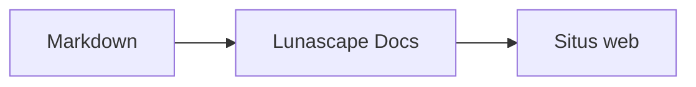

# Menulis diagram dan grafik

Cukup tentukan nama bahasa pada blok kode, maka isinya digambar sebagai diagram atau grafik. Semua penggambaran dilakukan di dalam perangkat Anda dan tidak memuat sumber daya eksternal.

## Diagram yang didukung

| Nama bahasa | Diagram | Cara menulisnya |
|---|---|---|
| `mermaid` | Diagram alir, diagram urutan, dan lainnya | Notasi Mermaid |
| `vega-lite` | Grafik data seperti grafik batang dan grafik garis | JSON Vega-Lite. Data disematkan pada `data.values` atau `datasets` |
| `markmap` | Peta pikiran | Judul dan daftar berpoin Markdown |
| `wavedrom` | Diagram pewaktuan | WaveJSON (JSON ketat) |
| `svgbob` | Diagram struktur ASCII art | Gambar teks menggunakan `+`, `-`, `>`, dan karakter garis |
| `tikz` | Diagram TikZ | Satu lingkungan `tikzpicture`. `tikzpicture` di dalam `$$...$$` / `\[...\]` pada dokumen yang sudah ada juga dikenali |
| `penrose` (eksperimental) | Diagram himpunan | Letakkan `@preset set-theory` di awal, lalu tulis hanya dengan `Set`, `Subset`, `Disjoint`, `Intersecting`, dan `AutoLabel All` |

### Contoh: Mermaid

````markdown

````

### Contoh: Vega-Lite

````markdown
```vega-lite
{
  "data": { "values": [ { "bulan": "April", "jumlah": 12 }, { "bulan": "Mei", "jumlah": 19 } ] },
  "mark": "bar",
  "encoding": {
    "x": { "field": "bulan", "type": "nominal" },
    "y": { "field": "jumlah", "type": "quantitative" }
  }
}
```
````

### Contoh: Svgbob

````markdown
```svgbob
+----------+      +----------+
| Markdown | ---> |   SVG    |
+----------+      +----------+
```
````

## Menyunting

Pada tampilan visual, diagram ditampilkan sebagai hasil penggambaran. Untuk mengubah isinya, tekan [Markdown] pada layar penyuntingan lalu sunting sumbernya. Menyimpan dari tampilan visual tetap mempertahankan sumber diagram apa adanya.

> **Perhatian**
>
> - Pustaka penggambar setiap diagram hanya dimuat ketika diagram tersebut ada di dalam dokumen.
> - Pada Vega-Lite, data dari URL eksternal dan mark gambar tidak dapat digunakan. WaveDrom hanya menerima JSON ketat, bukan bentuk JavaScript.
> - SVG yang dihasilkan disterilkan. Hasil yang memuat rujukan ke skrip, gambar eksternal, atau gaya eksternal tidak ditampilkan.
> - **TikZ**: ekstensi versi distribusi tidak menyertakan mesin penggambar, sehingga yang ditampilkan adalah sumber dalam keadaan terlipat. Untuk keperluan pengembangan dan evaluasi, Anda dapat memilih pengaturan `lunascapeDocEditor.tikz.runtime: "workspace"` yang menggunakan `node_modules/node-tikzjax` (1.0.5) pada ruang kerja tepercaya. Pada versi peramban web, TikZ tidak digambar.
> - **Penrose**: fitur eksperimental. Notasinya dapat berubah di kemudian hari.

## Topik terkait

- [Menulis rumus](math.md)
- [Diagram, rumus, atau gambar tidak tampil](../07-troubleshooting/rendering.md)
- [Spesifikasi utama](../08-reference/README.md)
