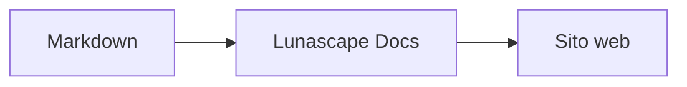

# Scrivere diagrammi e grafici

Basta indicare il nome del linguaggio in un blocco di codice perché venga rappresentato come diagramma o grafico. Tutto il rendering avviene sul tuo dispositivo; nessuna risorsa esterna viene caricata.

## Diagrammi supportati

| Nome del linguaggio | Diagramma | Come scriverlo |
|---|---|---|
| `mermaid` | Diagrammi di flusso, diagrammi di sequenza e altro | Sintassi Mermaid |
| `vega-lite` | Grafici di dati come istogrammi e grafici a linee | JSON di Vega-Lite. Inserisci i dati in `data.values` o `datasets` |
| `markmap` | Mappe mentali | Titoli ed elenchi puntati Markdown |
| `wavedrom` | Diagrammi di temporizzazione | WaveJSON (JSON rigoroso) |
| `svgbob` | Diagrammi di struttura in ASCII art | Disegni testuali con `+`, `-`, `>` e caratteri di riquadro |
| `tikz` | Figure TikZ | Un solo ambiente `tikzpicture`. Viene riconosciuto anche un `tikzpicture` all'interno di `$$...$$` / `\[...\]` nei documenti esistenti |
| `penrose` (sperimentale) | Diagrammi di insiemi | Inizia con `@preset set-theory` e usa solo `Set`, `Subset`, `Disjoint`, `Intersecting` e `AutoLabel All` |

### Esempio: Mermaid

````markdown

````

### Esempio: Vega-Lite

````markdown
```vega-lite
{
  "data": { "values": [ { "mese": "apr", "conteggio": 12 }, { "mese": "mag", "conteggio": 19 } ] },
  "mark": "bar",
  "encoding": {
    "x": { "field": "mese", "type": "nominal" },
    "y": { "field": "conteggio", "type": "quantitative" }
  }
}
```
````

### Esempio: Svgbob

````markdown
```svgbob
+----------+      +----------+
| Markdown | ---> |   SVG    |
+----------+      +----------+
```
````

## Modificare

Nella visualizzazione grafica, i diagrammi vengono mostrati come risultato del rendering. Per cambiarne il contenuto, premi [Markdown] nella schermata di modifica e modifica la sorgente. Salvando dalla visualizzazione grafica, la sorgente del diagramma resta invariata.

> **Nota**
>
> - Ogni libreria di rendering viene caricata solo quando il documento contiene quel tipo di diagramma.
> - Vega-Lite non può usare URL di dati esterni né mark di tipo immagine. WaveDrom accetta solo JSON rigoroso, non la forma JavaScript.
> - L'SVG generato viene sanificato. I risultati che contengono riferimenti a script, immagini esterne o stili esterni non vengono mostrati.
> - **TikZ**: la versione distribuita dell'estensione non include il motore di rendering, quindi viene mostrata la sorgente ripiegata. Per lo sviluppo e la valutazione, l'impostazione `lunascapeDocEditor.tikz.runtime: "workspace"` usa `node_modules/node-tikzjax` (1.0.5) nella radice di un'area di lavoro attendibile. Il visualizzatore Web non esegue il rendering di TikZ.
> - **Penrose**: una funzionalità sperimentale. La sintassi potrebbe cambiare in futuro.

## Argomenti correlati

- [Scrivere formule](math.md)
- [I diagrammi, le formule o le immagini non vengono visualizzati](../07-troubleshooting/rendering.md)
- [Specifiche principali](../08-reference/README.md)
