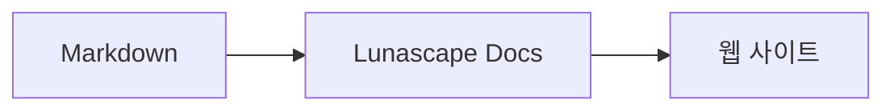

# 다이어그램과 그래프 그리기

코드 블록에 언어명을 지정하기만 하면 다이어그램이나 그래프로 그려집니다. 그리기는 모두 기기 안에서 이루어지며, 외부 리소스를 읽어 들이지 않습니다.

## 지원하는 다이어그램

| 언어명 | 다이어그램 | 작성 방법 |
|---|---|---|
| `mermaid` | 플로차트, 시퀀스 다이어그램 등 | Mermaid 기법 |
| `vega-lite` | 막대그래프, 꺾은선그래프 등의 데이터 그래프 | Vega-Lite의 JSON. 데이터는 `data.values` 또는 `datasets`에 삽입합니다 |
| `markmap` | 마인드맵 | Markdown의 제목과 글머리 기호 |
| `wavedrom` | 타이밍 다이어그램 | WaveJSON(엄격한 JSON) |
| `svgbob` | ASCII 아트 구성도 | `+`, `-`, `>`나 괘선 문자를 사용한 텍스트 다이어그램 |
| `tikz` | TikZ 다이어그램 | `tikzpicture` 환경 하나. 기존 문서의 `$$...$$` / `\[...\]` 안에 있는 `tikzpicture`도 인식합니다 |
| `penrose`(실험적) | 집합 다이어그램 | 맨 앞에 `@preset set-theory`를 두고, `Set`, `Subset`, `Disjoint`, `Intersecting`, `AutoLabel All`만으로 작성합니다 |

### 예: Mermaid

````markdown

````

### 예: Vega-Lite

````markdown
```vega-lite
{
  "data": { "values": [ { "월": "4월", "건수": 12 }, { "월": "5월", "건수": 19 } ] },
  "mark": "bar",
  "encoding": {
    "x": { "field": "월", "type": "nominal" },
    "y": { "field": "건수", "type": "quantitative" }
  }
}
```
````

### 예: Svgbob

````markdown
```svgbob
+----------+      +----------+
| Markdown | ---> |   SVG    |
+----------+      +----------+
```
````

## 편집하기

비주얼 표시에서는 다이어그램이 그려진 결과로 표시됩니다. 내용을 변경하려면 편집 화면에서 [Markdown]을 눌러 소스를 편집합니다. 비주얼 표시에서 저장해도 다이어그램의 소스는 그대로 유지됩니다.

> **참고**
>
> - 각 다이어그램의 그리기 라이브러리는 해당 다이어그램이 문서에 포함되어 있을 때만 읽어 들입니다.
> - Vega-Lite에서는 외부 URL의 데이터나 이미지 마크를 사용할 수 없습니다. WaveDrom은 엄격한 JSON만 받아들이며, JavaScript 형식은 사용할 수 없습니다.
> - 생성된 SVG는 무해화됩니다. 스크립트, 외부 이미지, 외부 스타일에 대한 참조를 포함하는 결과는 표시되지 않습니다.
> - **TikZ**: 배포판 확장 기능에는 그리기 엔진이 포함되어 있지 않으므로, 접힌 소스가 표시됩니다. 개발·평가 목적으로는 신뢰할 수 있는 작업 영역의 `node_modules/node-tikzjax`(1.0.5)를 사용하는 설정 `lunascapeDocEditor.tikz.runtime: "workspace"`를 선택할 수 있습니다. 웹 브라우저 버전에서는 TikZ가 그려지지 않습니다.
> - **Penrose**: 실험적인 기능입니다. 기법은 앞으로 변경될 수 있습니다.

## 관련 항목

- [수식 쓰기](math.md)
- [다이어그램·수식·이미지가 표시되지 않는다](../07-troubleshooting/rendering.md)
- [주요 사양](../08-reference/README.md)
