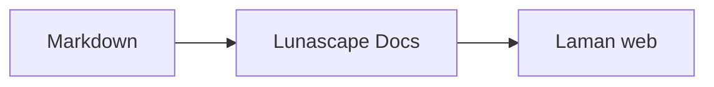

# Menulis rajah dan carta

Cukup tentukan nama bahasa pada blok kod, dan ia akan dilukis sebagai rajah atau carta. Semua lukisan dilakukan di dalam peranti anda; tiada sumber luaran dimuatkan.

## Rajah yang disokong

| Nama bahasa | Rajah | Cara menulisnya |
|---|---|---|
| `mermaid` | Carta alir, rajah jujukan dan lain-lain | Sintaks Mermaid |
| `vega-lite` | Carta data seperti carta bar dan carta garis | JSON Vega-Lite. Benamkan data dalam `data.values` atau `datasets` |
| `markmap` | Peta minda | Tajuk dan senarai berbutir Markdown |
| `wavedrom` | Rajah pemasaan | WaveJSON (JSON ketat) |
| `svgbob` | Rajah struktur seni ASCII | Rajah teks menggunakan `+`, `-`, `>` dan aksara lukisan kotak |
| `tikz` | Rajah TikZ | Satu persekitaran `tikzpicture`. `tikzpicture` di dalam `$$...$$` / `\[...\]` pada dokumen sedia ada turut dikenali |
| `penrose` (eksperimen) | Rajah set | Letakkan `@preset set-theory` di bahagian awal, dan tulis hanya dengan `Set`, `Subset`, `Disjoint`, `Intersecting` dan `AutoLabel All` |

### Contoh: Mermaid

````markdown

````

### Contoh: Vega-Lite

````markdown
```vega-lite
{
  "data": { "values": [ { "bulan": "April", "bilangan": 12 }, { "bulan": "Mei", "bilangan": 19 } ] },
  "mark": "bar",
  "encoding": {
    "x": { "field": "bulan", "type": "nominal" },
    "y": { "field": "bilangan", "type": "quantitative" }
  }
}
```
````

### Contoh: Svgbob

````markdown
```svgbob
+----------+      +----------+
| Markdown | ---> |   SVG    |
+----------+      +----------+
```
````

## Menyunting

Dalam paparan visual, rajah dipaparkan sebagai hasil lukisan. Untuk mengubah kandungannya, tekan [Markdown] pada skrin penyuntingan dan sunting sumbernya. Menyimpan daripada paparan visual mengekalkan sumber rajah seperti sedia ada.

> **Perhatian**
>
> - Pustaka lukisan bagi setiap rajah dimuatkan hanya apabila dokumen mengandungi rajah jenis tersebut.
> - Vega-Lite tidak boleh menggunakan data URL luaran atau tanda imej. WaveDrom hanya menerima JSON ketat, bukan bentuk JavaScript.
> - SVG yang dijana akan dinyahbahaya. Hasil yang merujuk skrip, imej luaran atau gaya luaran tidak dipaparkan.
> - **TikZ**: sambungan versi edaran tidak disertakan enjin lukisan, jadi sumber yang terlipat dipaparkan. Untuk tujuan pembangunan dan penilaian, anda boleh memilih tetapan `lunascapeDocEditor.tikz.runtime: "workspace"` yang menggunakan `node_modules/node-tikzjax` (1.0.5) pada ruang kerja dipercayai. Versi pelayar web tidak melukis TikZ.
> - **Penrose**: ciri eksperimen. Sintaksnya mungkin berubah kemudian.

## Topik berkaitan

- [Menulis rumus matematik](math.md)
- [Rajah, rumus matematik atau imej tidak dipaparkan](../07-troubleshooting/rendering.md)
- [Spesifikasi utama](../08-reference/README.md)
