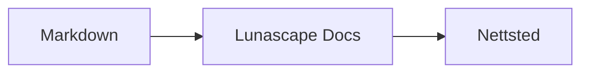

# Skrive diagrammer og grafer

Gi en kodeblokk riktig språknavn, så tegnes den som et diagram eller en graf. All tegning skjer på enheten din; ingen eksterne ressurser lastes inn.

## Diagrammer som støttes

| Språknavn | Diagram | Slik skriver du det |
|---|---|---|
| `mermaid` | Flytdiagrammer, sekvensdiagrammer med mer | Mermaid-notasjon |
| `vega-lite` | Datagrafer som stolpe- og linjediagrammer | Vega-Lite-JSON. Legg dataene i `data.values` eller `datasets` |
| `markmap` | Tankekart | Markdown-overskrifter og punktlister |
| `wavedrom` | Tidsdiagrammer | WaveJSON (strengt JSON) |
| `svgbob` | Strukturdiagrammer i ASCII-kunst | Tekstdiagrammer med `+`, `-`, `>` og strektegn |
| `tikz` | TikZ-diagrammer | Ett `tikzpicture`-miljø. Et `tikzpicture` inni `$$...$$` / `\[...\]` i eksisterende dokumenter gjenkjennes også |
| `penrose` (eksperimentell) | Mengdediagrammer | Start med `@preset set-theory` og bruk bare `Set`, `Subset`, `Disjoint`, `Intersecting` og `AutoLabel All` |

### Eksempel: Mermaid

````markdown

````

### Eksempel: Vega-Lite

````markdown
```vega-lite
{
  "data": { "values": [ { "måned": "Apr", "antall": 12 }, { "måned": "Mai", "antall": 19 } ] },
  "mark": "bar",
  "encoding": {
    "x": { "field": "måned", "type": "nominal" },
    "y": { "field": "antall", "type": "quantitative" }
  }
}
```
````

### Eksempel: Svgbob

````markdown
```svgbob
+----------+      +----------+
| Markdown | ---> |   SVG    |
+----------+      +----------+
```
````

## Redigere

I den visuelle visningen vises diagrammer ferdig tegnet. For å endre et diagram trykker du [Markdown] i redigeringsvinduet og redigerer kilden. Når du lagrer fra den visuelle visningen, beholdes diagramkilden uendret.

> **Merk**
>
> - Hvert tegnebibliotek lastes bare inn når dokumentet inneholder den typen diagram.
> - Vega-Lite kan ikke bruke eksterne data-URL-er eller bildemerker. WaveDrom godtar bare strengt JSON, ikke JavaScript-formen.
> - Generert SVG renses. Utdata som refererer til skript, eksterne bilder eller eksterne stiler, vises ikke.
> - **TikZ**: den distribuerte utvidelsen har ingen innebygd tegnemotor, så sammenslått kilde vises i stedet. For utvikling og evaluering bruker innstillingen `lunascapeDocEditor.tikz.runtime: "workspace"` `node_modules/node-tikzjax` (1.0.5) i roten av et klarert arbeidsområde. Web-visningen tegner ikke TikZ.
> - **Penrose**: en eksperimentell funksjon. Notasjonen kan endre seg.

## Relaterte emner

- [Skrive matematikk](math.md)
- [Diagrammer, matematikk eller bilder vises ikke](../07-troubleshooting/rendering.md)
- [Spesifikasjoner](../08-reference/README.md)
