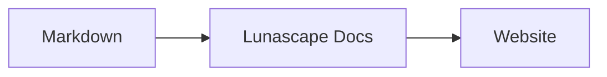

# Diagrammen en grafieken schrijven

U hoeft alleen de taalnaam van een codeblok op te geven en het wordt als diagram of grafiek weergegeven. Alles wordt op uw eigen apparaat weergegeven; er worden geen externe bronnen geladen.

## Ondersteunde diagrammen

| Taalnaam | Diagram | Schrijfwijze |
|---|---|---|
| `mermaid` | Stroomdiagrammen, sequentiediagrammen en meer | Mermaid-notatie |
| `vega-lite` | Datagrafieken zoals staaf- en lijndiagrammen | Vega-Lite-JSON. Data neemt u op in `data.values` of `datasets` |
| `markmap` | Mindmaps | Koppen en opsommingen in Markdown |
| `wavedrom` | Timingdiagrammen | WaveJSON (strikte JSON) |
| `svgbob` | Structuurdiagrammen in ASCII-art | Teksttekeningen met `+`, `-`, `>` en lijntekens |
| `tikz` | TikZ-figuren | Eén `tikzpicture`-omgeving. Een `tikzpicture` binnen `$$...$$` / `\[...\]` in bestaande documenten wordt ook herkend |
| `penrose` (experimenteel) | Verzamelingsdiagrammen | Begin met `@preset set-theory` en gebruik alleen `Set`, `Subset`, `Disjoint`, `Intersecting` en `AutoLabel All` |

### Voorbeeld: Mermaid

````markdown

````

### Voorbeeld: Vega-Lite

````markdown
```vega-lite
{
  "data": { "values": [ { "maand": "apr", "aantal": 12 }, { "maand": "mei", "aantal": 19 } ] },
  "mark": "bar",
  "encoding": {
    "x": { "field": "maand", "type": "nominal" },
    "y": { "field": "aantal", "type": "quantitative" }
  }
}
```
````

### Voorbeeld: Svgbob

````markdown
```svgbob
+----------+      +----------+
| Markdown | ---> |   SVG    |
+----------+      +----------+
```
````

## Bewerken

In de visuele weergave ziet u het weergegeven diagram. Druk in het bewerkscherm op [Markdown] om de inhoud te wijzigen en bewerk de bron. Als u vanuit de visuele weergave opslaat, blijft de bron van het diagram ongewijzigd.

> **Let op**
>
> - De weergavebibliotheek van elk diagram wordt alleen geladen wanneer het document dat soort diagram bevat.
> - In Vega-Lite kunt u geen data van een externe URL en geen afbeeldingsmarkeringen gebruiken. WaveDrom accepteert alleen strikte JSON, niet de JavaScript-vorm.
> - De gegenereerde SVG wordt ontdaan van onveilige elementen. Resultaten die verwijzen naar scripts, externe afbeeldingen of externe stijlen worden niet weergegeven.
> - **TikZ**: bij de gedistribueerde extensie wordt geen weergave-engine meegeleverd, dus wordt de ingeklapte bron getoond. Voor ontwikkeling en evaluatie kunt u de instelling `lunascapeDocEditor.tikz.runtime: "workspace"` kiezen, die `node_modules/node-tikzjax` (1.0.5) in een vertrouwde werkruimte gebruikt. In de webbrowserversie wordt TikZ niet weergegeven.
> - **Penrose**: een experimentele functie. De notatie kan in de toekomst veranderen.

## Verwante onderwerpen

- [Formules schrijven](math.md)
- [Diagrammen, formules of afbeeldingen worden niet weergegeven](../07-troubleshooting/rendering.md)
- [Belangrijkste specificaties](../08-reference/README.md)
