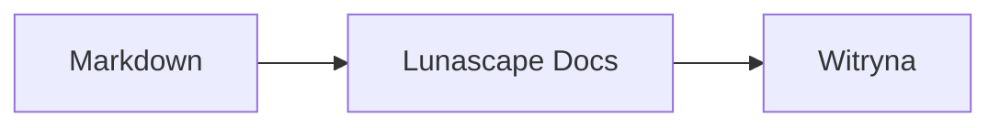

# Rysowanie diagramów i wykresów

Wystarczy nadać blokowi kodu odpowiednią nazwę języka, aby został on wyświetlony jako diagram lub wykres. Całe rysowanie odbywa się na Twoim urządzeniu; żadne zasoby zewnętrzne nie są wczytywane.

## Obsługiwane diagramy

| Nazwa języka | Diagram | Jak zapisać |
|---|---|---|
| `mermaid` | Schematy blokowe, diagramy sekwencji i inne | Składnia Mermaid |
| `vega-lite` | Wykresy danych, takie jak słupkowe i liniowe | JSON Vega-Lite. Dane osadź w `data.values` lub `datasets` |
| `markmap` | Mapy myśli | Nagłówki i listy Markdown |
| `wavedrom` | Diagramy czasowe | WaveJSON (ścisły JSON) |
| `svgbob` | Diagramy struktury w ASCII-art | Rysunki tekstowe z użyciem `+`, `-`, `>` oraz znaków rysowania ramek |
| `tikz` | Rysunki TikZ | Jedno środowisko `tikzpicture`. Rozpoznawane jest też `tikzpicture` wewnątrz `$$...$$` / `\[...\]` w istniejących dokumentach |
| `penrose` (eksperymentalny) | Diagramy zbiorów | Zacznij od `@preset set-theory` i używaj wyłącznie `Set`, `Subset`, `Disjoint`, `Intersecting` oraz `AutoLabel All` |

### Przykład: Mermaid

````markdown

````

### Przykład: Vega-Lite

````markdown
```vega-lite
{
  "data": { "values": [ { "miesiąc": "kwi", "liczba": 12 }, { "miesiąc": "maj", "liczba": 19 } ] },
  "mark": "bar",
  "encoding": {
    "x": { "field": "miesiąc", "type": "nominal" },
    "y": { "field": "liczba", "type": "quantitative" }
  }
}
```
````

### Przykład: Svgbob

````markdown
```svgbob
+----------+      +----------+
| Markdown | ---> |   SVG    |
+----------+      +----------+
```
````

## Edycja

W widoku wizualnym diagramy są pokazywane w postaci wyrenderowanej. Aby zmienić diagram, naciśnij [Markdown] w edytorze i edytuj źródło. Zapisanie z widoku wizualnego pozostawia źródło diagramu bez zmian.

> **Uwaga**
>
> - Każda biblioteka renderująca jest wczytywana tylko wtedy, gdy dokument zawiera dany rodzaj diagramu.
> - Vega-Lite nie może korzystać z zewnętrznych adresów URL danych ani ze znaczników obrazów. WaveDrom przyjmuje wyłącznie ścisły JSON, a nie formę JavaScript.
> - Wygenerowany SVG jest oczyszczany. Wynik, który odwołuje się do skryptów, obrazów zewnętrznych lub stylów zewnętrznych, nie jest wyświetlany.
> - **TikZ**: dystrybuowane rozszerzenie nie zawiera silnika renderującego, więc zamiast diagramu pokazywane jest zwinięte źródło. Na potrzeby rozwoju i oceny ustawienie `lunascapeDocEditor.tikz.runtime: "workspace"` używa `node_modules/node-tikzjax` (1.0.5) w katalogu głównym zaufanego obszaru roboczego. Przeglądarkowa wersja Web nie renderuje TikZ.
> - **Penrose**: funkcja eksperymentalna. Składnia może się zmienić.

## Powiązane tematy

- [Zapisywanie wzorów matematycznych](math.md)
- [Diagramy, wzory matematyczne lub obrazy nie są renderowane](../07-troubleshooting/rendering.md)
- [Specyfikacje](../08-reference/README.md)
