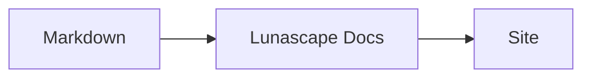

# Escrever diagramas e gráficos

Basta indicar o nome da linguagem em um bloco de código para que ele seja renderizado como diagrama ou gráfico. Toda a renderização acontece no seu dispositivo; nenhum recurso externo é carregado.

## Diagramas compatíveis

| Nome da linguagem | Diagrama | Como escrever |
|---|---|---|
| `mermaid` | Fluxogramas, diagramas de sequência e outros | Sintaxe do Mermaid |
| `vega-lite` | Gráficos de dados, como gráficos de barras e de linhas | JSON do Vega-Lite. Incorpore os dados em `data.values` ou `datasets` |
| `markmap` | Mapas mentais | Títulos e listas do Markdown |
| `wavedrom` | Diagramas de temporização | WaveJSON (JSON estrito) |
| `svgbob` | Diagramas de estrutura em ASCII art | Desenhos de texto usando `+`, `-`, `>` e caracteres de traçado de caixa |
| `tikz` | Figuras do TikZ | Um ambiente `tikzpicture`. Um `tikzpicture` dentro de `$$...$$` / `\[...\]` em documentos existentes também é reconhecido |
| `penrose` (experimental) | Diagramas de conjuntos | Comece com `@preset set-theory` e use apenas `Set`, `Subset`, `Disjoint`, `Intersecting` e `AutoLabel All` |

### Exemplo: Mermaid

````markdown

````

### Exemplo: Vega-Lite

````markdown
```vega-lite
{
  "data": { "values": [ { "mês": "Abr", "contagem": 12 }, { "mês": "Mai", "contagem": 19 } ] },
  "mark": "bar",
  "encoding": {
    "x": { "field": "mês", "type": "nominal" },
    "y": { "field": "contagem", "type": "quantitative" }
  }
}
```
````

### Exemplo: Svgbob

````markdown
```svgbob
+----------+      +----------+
| Markdown | ---> |   SVG    |
+----------+      +----------+
```
````

## Editar

Na exibição visual, os diagramas aparecem já renderizados. Para alterar um deles, pressione [Markdown] na tela de edição e edite a origem. Salvar a partir da exibição visual mantém a origem do diagrama inalterada.

> **Nota**
>
> - Cada biblioteca de renderização só é carregada quando o documento contém aquele tipo de diagrama.
> - O Vega-Lite não pode usar URLs de dados externos nem marcas de imagem. O WaveDrom aceita apenas JSON estrito, não o formato JavaScript.
> - O SVG gerado é sanitizado. Um resultado que faça referência a scripts, imagens externas ou estilos externos não é exibido.
> - **TikZ**: a extensão distribuída não inclui um mecanismo de renderização, portanto a origem recolhida é exibida no lugar. Para desenvolvimento e avaliação, a configuração `lunascapeDocEditor.tikz.runtime: "workspace"` usa o `node_modules/node-tikzjax` (1.0.5) na raiz de um espaço de trabalho confiável. O visualizador Web não renderiza TikZ.
> - **Penrose**: um recurso experimental. A sintaxe pode mudar.

## Tópicos relacionados

- [Escrever fórmulas](math.md)
- [Diagramas, fórmulas ou imagens não são exibidos](../07-troubleshooting/rendering.md)
- [Especificações](../08-reference/README.md)
