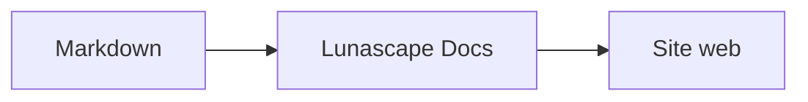

# Scrierea diagramelor și a graficelor

Este suficient să indicați numele limbajului într-un bloc de cod pentru ca acesta să fie redat ca diagramă sau grafic. Redarea are loc în întregime pe dispozitivul dumneavoastră; nu se încarcă resurse externe.

## Diagrame acceptate

| Nume de limbaj | Diagramă | Mod de scriere |
|---|---|---|
| `mermaid` | Diagrame de flux, diagrame de secvență și altele | Sintaxa Mermaid |
| `vega-lite` | Grafice de date, precum cele cu bare sau cu linii | JSON Vega-Lite. Datele se includ în `data.values` sau în `datasets` |
| `markmap` | Hărți mentale | Titluri și liste Markdown |
| `wavedrom` | Diagrame de sincronizare | WaveJSON (JSON strict) |
| `svgbob` | Diagrame de structură în ASCII art | Desene text cu `+`, `-`, `>` și caractere de trasare a chenarelor |
| `tikz` | Figuri TikZ | Un singur mediu `tikzpicture`. Este recunoscut și un `tikzpicture` aflat între `$$...$$` / `\[...\]` în documentele existente |
| `penrose` (experimental) | Diagrame de mulțimi | Începeți cu `@preset set-theory` și folosiți doar `Set`, `Subset`, `Disjoint`, `Intersecting` și `AutoLabel All` |

### Exemplu: Mermaid

````markdown

````

### Exemplu: Vega-Lite

````markdown
```vega-lite
{
  "data": { "values": [ { "luna": "apr.", "număr": 12 }, { "luna": "mai", "număr": 19 } ] },
  "mark": "bar",
  "encoding": {
    "x": { "field": "luna", "type": "nominal" },
    "y": { "field": "număr", "type": "quantitative" }
  }
}
```
````

### Exemplu: Svgbob

````markdown
```svgbob
+----------+      +----------+
| Markdown | ---> |   SVG    |
+----------+      +----------+
```
````

## Editarea

În vizualizarea vizuală, diagramele apar sub formă redată. Pentru a modifica o diagramă, apăsați [Markdown] în ecranul de editare și modificați sursa. Salvarea din vizualizarea vizuală păstrează sursa diagramei neschimbată.

> **Notă**
>
> - Biblioteca de redare a fiecărei diagrame se încarcă doar atunci când documentul conține tipul respectiv de diagramă.
> - În Vega-Lite nu se pot folosi date de la adrese URL externe și nici marcaje de imagine. WaveDrom acceptă numai JSON strict, nu și forma JavaScript.
> - Codul SVG generat este igienizat. Rezultatele care conțin referințe la scripturi, la imagini externe sau la stiluri externe nu sunt afișate.
> - **TikZ**: extensia distribuită nu include un motor de redare, așa că se afișează sursa restrânsă. În scopuri de dezvoltare și evaluare, setarea `lunascapeDocEditor.tikz.runtime: "workspace"` folosește `node_modules/node-tikzjax` (1.0.5) din rădăcina unui spațiu de lucru de încredere. În versiunea pentru browser web, TikZ nu este redat.
> - **Penrose**: o funcție experimentală. Sintaxa se poate modifica pe viitor.

## Subiecte înrudite

- [Scrierea formulelor matematice](math.md)
- [Diagramele, formulele matematice sau imaginile nu se afișează](../07-troubleshooting/rendering.md)
- [Specificații principale](../08-reference/README.md)
