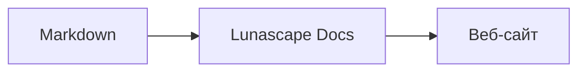

# Как рисовать схемы и графики

Достаточно указать имя языка у блока кода, и он отображается как схема или график. Всё рисование выполняется на устройстве; внешние ресурсы не загружаются.

## Поддерживаемые схемы

| Имя языка | Схема | Как писать |
|---|---|---|
| `mermaid` | Блок-схемы, диаграммы последовательностей и другое | Синтаксис Mermaid |
| `vega-lite` | Графики данных, например столбчатые и линейные | JSON Vega-Lite. Данные встраиваются в `data.values` или `datasets` |
| `markmap` | Интеллект-карты | Заголовки и списки Markdown |
| `wavedrom` | Временны́е диаграммы | WaveJSON (строгий JSON) |
| `svgbob` | Структурные схемы из ASCII-графики | Текстовые рисунки с использованием `+`, `-`, `>` и символов псевдографики |
| `tikz` | Схемы TikZ | Одно окружение `tikzpicture`. Распознаётся также `tikzpicture` внутри `$$...$$` / `\[...\]` в существующих документах |
| `penrose` (экспериментально) | Диаграммы множеств | Начните с `@preset set-theory` и используйте только `Set`, `Subset`, `Disjoint`, `Intersecting` и `AutoLabel All` |

### Пример: Mermaid

````markdown

````

### Пример: Vega-Lite

````markdown
```vega-lite
{
  "data": { "values": [ { "месяц": "апр.", "количество": 12 }, { "месяц": "май", "количество": 19 } ] },
  "mark": "bar",
  "encoding": {
    "x": { "field": "месяц", "type": "nominal" },
    "y": { "field": "количество", "type": "quantitative" }
  }
}
```
````

### Пример: Svgbob

````markdown
```svgbob
+----------+      +----------+
| Markdown | ---> |   SVG    |
+----------+      +----------+
```
````

## Редактирование

В визуальном режиме схемы показываются в отрисованном виде. Чтобы изменить содержимое, нажмите [Markdown] в окне редактора и отредактируйте исходный текст. При сохранении из визуального режима исходный текст схемы остаётся без изменений.

> **Примечание**
>
> - Библиотека для рисования каждой схемы загружается только тогда, когда документ содержит схему этого типа.
> - В Vega-Lite нельзя использовать данные по внешним URL или маркеры-изображения. WaveDrom принимает только строгий JSON, но не форму JavaScript.
> - Созданный SVG обезвреживается. Результат, содержащий ссылки на скрипты, внешние изображения или внешние стили, не отображается.
> - **TikZ**: в распространяемой версии расширения движок рисования не поставляется, поэтому вместо схемы показывается свёрнутый исходный текст. Для разработки и оценки можно выбрать параметр `lunascapeDocEditor.tikz.runtime: "workspace"`, который использует `node_modules/node-tikzjax` (1.0.5) в корне надежной рабочей области. В веб-версии браузера TikZ не отрисовывается.
> - **Penrose**: экспериментальная функция. Синтаксис может измениться в будущем.

## См. также

- [Как писать формулы](math.md)
- [Схемы, формулы или изображения не отображаются](../07-troubleshooting/rendering.md)
- [Основные спецификации](../08-reference/README.md)
