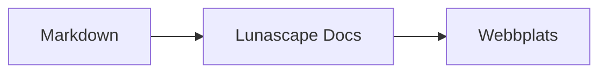

# Skriva diagram och grafer

Ange bara språknamnet i ett kodblock, så ritas det upp som ett diagram eller en graf. All uppritning sker i enheten; inga externa resurser läses in.

## Diagram som stöds

| Språknamn | Diagram | Så skriver du |
|---|---|---|
| `mermaid` | Flödesscheman, sekvensdiagram med mera | Mermaid-syntax |
| `vega-lite` | Datagrafer som stapel- och linjediagram | Vega-Lite-JSON. Bädda in data i `data.values` eller `datasets` |
| `markmap` | Tankekartor | Rubriker och punktlistor i Markdown |
| `wavedrom` | Tidsdiagram | WaveJSON (strikt JSON) |
| `svgbob` | Strukturdiagram i ASCII-konst | Textfigurer med `+`, `-`, `>` och linjeritningstecken |
| `tikz` | TikZ-figurer | En `tikzpicture`-miljö. En `tikzpicture` inuti `$$...$$` / `\[...\]` i befintliga dokument känns också igen |
| `penrose` (experimentell) | Mängddiagram | Inled med `@preset set-theory` och använd endast `Set`, `Subset`, `Disjoint`, `Intersecting` och `AutoLabel All` |

### Exempel: Mermaid

````markdown

````

### Exempel: Vega-Lite

````markdown
```vega-lite
{
  "data": { "values": [ { "månad": "apr", "antal": 12 }, { "månad": "maj", "antal": 19 } ] },
  "mark": "bar",
  "encoding": {
    "x": { "field": "månad", "type": "nominal" },
    "y": { "field": "antal", "type": "quantitative" }
  }
}
```
````

### Exempel: Svgbob

````markdown
```svgbob
+----------+      +----------+
| Markdown | ---> |   SVG    |
+----------+      +----------+
```
````

## Redigera

I den visuella vyn visas diagrammen som färdigt uppritade. Om du vill ändra innehållet trycker du på [Markdown] i redigeringsvyn och redigerar källan. Om du sparar från den visuella vyn behålls diagrammets källa oförändrad.

> **Obs!**
>
> - Varje uppritningsbibliotek läses in endast när dokumentet innehåller den sortens diagram.
> - Vega-Lite kan inte använda data från externa URL:er eller bildmarkeringar. WaveDrom godtar endast strikt JSON, inte JavaScript-formen.
> - Genererad SVG saneras. Resultat som hänvisar till skript, externa bilder eller externa stilar visas inte.
> - **TikZ**: den distribuerade tilläggsversionen innehåller ingen uppritningsmotor, så källan visas hopfälld i stället. För utveckling och utvärdering kan du välja inställningen `lunascapeDocEditor.tikz.runtime: "workspace"`, som använder `node_modules/node-tikzjax` (1.0.5) i roten av en betrodd arbetsyta. I webbläsarversionen ritas TikZ inte upp.
> - **Penrose**: en experimentell funktion. Syntaxen kan komma att ändras.

## Relaterade avsnitt

- [Skriva matematik](math.md)
- [Diagram, matematik eller bilder visas inte](../07-troubleshooting/rendering.md)
- [Huvudsakliga specifikationer](../08-reference/README.md)
