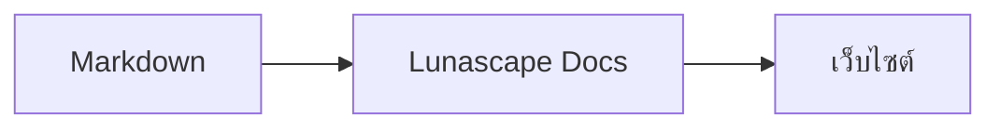

# การเขียนแผนภาพและกราฟ

เพียงระบุชื่อภาษาให้กับบล็อกโค้ด ระบบจะแสดงผลเป็นแผนภาพหรือกราฟให้ การแสดงผลทั้งหมดทำงานภายในเครื่องของคุณ โดยไม่โหลดทรัพยากรจากภายนอก

## แผนภาพที่รองรับ

| ชื่อภาษา | แผนภาพ | วิธีเขียน |
|---|---|---|
| `mermaid` | ผังงาน แผนภาพลำดับ และอื่น ๆ | ไวยากรณ์ของ Mermaid |
| `vega-lite` | กราฟข้อมูล เช่น กราฟแท่งและกราฟเส้น | JSON ของ Vega-Lite ฝังข้อมูลไว้ใน `data.values` หรือ `datasets` |
| `markmap` | แผนที่ความคิด | หัวเรื่องและรายการของ Markdown |
| `wavedrom` | แผนภาพจังหวะเวลา | WaveJSON (JSON แบบเคร่งครัด) |
| `svgbob` | แผนภาพโครงสร้างแบบ ASCII art | ภาพจากข้อความที่ใช้ `+`, `-`, `>` และอักขระเส้นตาราง |
| `tikz` | แผนภาพ TikZ | สภาพแวดล้อม `tikzpicture` หนึ่งชุด และรองรับ `tikzpicture` ที่อยู่ใน `$$...$$` / `\[...\]` ของเอกสารเดิมด้วย |
| `penrose` (ทดลอง) | แผนภาพเซต | วาง `@preset set-theory` ไว้บรรทัดแรก แล้วเขียนด้วย `Set`, `Subset`, `Disjoint`, `Intersecting` และ `AutoLabel All` เท่านั้น |

### ตัวอย่าง: Mermaid

````markdown

````

### ตัวอย่าง: Vega-Lite

````markdown
```vega-lite
{
  "data": { "values": [ { "เดือน": "เม.ย.", "จำนวน": 12 }, { "เดือน": "พ.ค.", "จำนวน": 19 } ] },
  "mark": "bar",
  "encoding": {
    "x": { "field": "เดือน", "type": "nominal" },
    "y": { "field": "จำนวน", "type": "quantitative" }
  }
}
```
````

### ตัวอย่าง: Svgbob

````markdown
```svgbob
+----------+      +----------+
| Markdown | ---> |   SVG    |
+----------+      +----------+
```
````

## การแก้ไข

ในมุมมองแบบภาพ แผนภาพจะแสดงเป็นผลลัพธ์ที่วาดแล้ว หากต้องการเปลี่ยนเนื้อหา ให้กด [Markdown] ในหน้าจอแก้ไข แล้วแก้ไขต้นฉบับ การบันทึกจากมุมมองแบบภาพจะคงต้นฉบับของแผนภาพไว้ตามเดิม

> **ข้อควรระวัง**
>
> - ไลบรารีสำหรับวาดแผนภาพแต่ละชนิดจะถูกโหลดเฉพาะเมื่อเอกสารมีแผนภาพชนิดนั้นอยู่
> - Vega-Lite ไม่สามารถใช้ข้อมูลจาก URL ภายนอกหรือ image mark ได้ ส่วน WaveDrom รับเฉพาะ JSON แบบเคร่งครัดเท่านั้น ไม่รองรับรูปแบบ JavaScript
> - SVG ที่สร้างขึ้นจะถูกทำให้ปลอดภัย ผลลัพธ์ที่อ้างอิงสคริปต์ รูปภาพภายนอก หรือสไตล์ภายนอก จะไม่ถูกแสดง
> - **TikZ**: ส่วนขยายรุ่นที่เผยแพร่ไม่ได้รวมเอนจินสำหรับวาดมาด้วย จึงแสดงเป็นต้นฉบับที่พับเก็บไว้แทน สำหรับการพัฒนาและการประเมินผล คุณสามารถเลือกการตั้งค่า `lunascapeDocEditor.tikz.runtime: "workspace"` ซึ่งจะใช้ `node_modules/node-tikzjax` (1.0.5) ที่รากของพื้นที่ทำงานที่เชื่อถือได้ ส่วนรุ่นเว็บเบราว์เซอร์จะไม่แสดงผล TikZ
> - **Penrose**: เป็นฟีเจอร์ทดลอง ไวยากรณ์อาจเปลี่ยนแปลงได้ในอนาคต

## หัวข้อที่เกี่ยวข้อง

- [การเขียนสูตรคณิตศาสตร์](math.md)
- [แผนภาพ สูตรคณิตศาสตร์ หรือรูปภาพไม่แสดงผล](../07-troubleshooting/rendering.md)
- [ข้อกำหนดหลัก](../08-reference/README.md)
