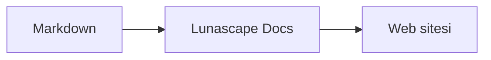

# Diyagram ve grafik yazma

Bir kod bloğuna doğru dil adını verin; diyagram veya grafik olarak çizilir. Tüm çizim işlemleri cihazınızda yapılır; hiçbir dış kaynak yüklenmez.

## Desteklenen diyagramlar

| Dil adı | Diyagram | Nasıl yazılır |
|---|---|---|
| `mermaid` | Akış şemaları, sıra diyagramları ve daha fazlası | Mermaid söz dizimi |
| `vega-lite` | Çubuk ve çizgi grafiği gibi veri grafikleri | Vega-Lite JSON. Veriyi `data.values` veya `datasets` içine gömün |
| `markmap` | Zihin haritaları | Markdown başlıkları ve madde işaretleri |
| `wavedrom` | Zamanlama diyagramları | WaveJSON (katı JSON) |
| `svgbob` | ASCII sanatı yapı diyagramları | `+`, `-`, `>` ve çerçeve çizgi karakterleriyle yapılan metin çizimleri |
| `tikz` | TikZ diyagramları | Tek bir `tikzpicture` ortamı. Mevcut belgelerdeki `$$...$$` / `\[...\]` içindeki `tikzpicture` de tanınır |
| `penrose` (deneysel) | Küme diyagramları | Başına `@preset set-theory` koyun ve yalnızca `Set`, `Subset`, `Disjoint`, `Intersecting` ve `AutoLabel All` kullanın |

### Örnek: Mermaid

````markdown

````

### Örnek: Vega-Lite

````markdown
```vega-lite
{
  "data": { "values": [ { "ay": "Nis", "adet": 12 }, { "ay": "May", "adet": 19 } ] },
  "mark": "bar",
  "encoding": {
    "x": { "field": "ay", "type": "nominal" },
    "y": { "field": "adet", "type": "quantitative" }
  }
}
```
````

### Örnek: Svgbob

````markdown
```svgbob
+----------+      +----------+
| Markdown | ---> |   SVG    |
+----------+      +----------+
```
````

## Düzenleme

Görsel görünümde diyagramlar çizilmiş olarak gösterilir. Birini değiştirmek için düzenleyicide [Markdown] düğmesine basın ve kaynağı düzenleyin. Görsel görünümden kaydetmek, diyagramın kaynağını olduğu gibi korur.

> **Not**
>
> - Her çizim kütüphanesi, yalnızca belge o türden bir diyagram içerdiğinde yüklenir.
> - Vega-Lite dış veri URL'lerini veya görsel işaretlerini kullanamaz. WaveDrom yalnızca katı JSON kabul eder, JavaScript biçimini kabul etmez.
> - Oluşturulan SVG temizlenir. Betiklere, dış görsellere veya dış stillere başvuran çıktı gösterilmez.
> - **TikZ**: dağıtılan uzantı bir çizim motoru içermez, bu yüzden bunun yerine katlanmış kaynak gösterilir. Geliştirme ve değerlendirme için, `lunascapeDocEditor.tikz.runtime: "workspace"` ayarı, güvenilen çalışma alanının kökündeki `node_modules/node-tikzjax` (1.0.5) sürümünü kullanır. Web görüntüleyici TikZ çizmez.
> - **Penrose**: deneysel bir özelliktir. Söz dizimi değişebilir.

## İlgili konular

- [Matematik yazma](math.md)
- [Diyagramlar, matematik veya görseller görüntülenmiyor](../07-troubleshooting/rendering.md)
- [Şartname](../08-reference/README.md)
