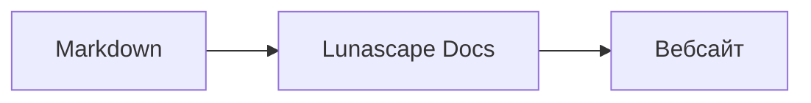

# Створення діаграм і графіків

Достатньо вказати назву мови для блоку коду — і він відображається як діаграма або графік. Усе відтворення відбувається на вашому пристрої; зовнішні ресурси не завантажуються.

## Підтримувані діаграми

| Назва мови | Діаграма | Як писати |
|---|---|---|
| `mermaid` | Блок-схеми, діаграми послідовності тощо | Синтаксис Mermaid |
| `vega-lite` | Графіки даних: стовпчасті, лінійні тощо | JSON формату Vega-Lite. Дані вбудовуйте в `data.values` або `datasets` |
| `markmap` | Інтелект-карти | Заголовки та списки Markdown |
| `wavedrom` | Часові діаграми | WaveJSON (строгий JSON) |
| `svgbob` | Структурні діаграми в стилі ASCII-графіки | Текстові рисунки зі знаків `+`, `-`, `>` та символів псевдографіки |
| `tikz` | Рисунки TikZ | Одне середовище `tikzpicture`. Розпізнається також `tikzpicture` усередині `$$...$$` / `\[...\]` в наявних документах |
| `penrose` (експериментально) | Діаграми множин | На початку розмістіть `@preset set-theory` і використовуйте лише `Set`, `Subset`, `Disjoint`, `Intersecting` та `AutoLabel All` |

### Приклад: Mermaid

````markdown

````

### Приклад: Vega-Lite

````markdown
```vega-lite
{
  "data": { "values": [ { "місяць": "квітень", "кількість": 12 }, { "місяць": "травень", "кількість": 19 } ] },
  "mark": "bar",
  "encoding": {
    "x": { "field": "місяць", "type": "nominal" },
    "y": { "field": "кількість", "type": "quantitative" }
  }
}
```
````

### Приклад: Svgbob

````markdown
```svgbob
+----------+      +----------+
| Markdown | ---> |   SVG    |
+----------+      +----------+
```
````

## Редагування

У візуальному поданні діаграми показано у відтвореному вигляді. Щоб змінити вміст, натисніть [Markdown] на екрані редагування та відредагуйте джерельний код. Збереження у візуальному поданні залишає джерельний код діаграми без змін.

> **Примітка**
>
> - Бібліотека відтворення для кожного типу діаграм завантажується лише тоді, коли документ містить діаграму цього типу.
> - У Vega-Lite не можна використовувати дані із зовнішніх URL-адрес та позначки-зображення. WaveDrom приймає лише строгий JSON, формат JavaScript не підтримується.
> - Згенерований SVG знешкоджується. Результат із посиланнями на скрипти, зовнішні зображення або зовнішні стилі не відображається.
> - **TikZ**: у розповсюджуваному розширенні немає вбудованого рушія відтворення, тому показується згорнутий джерельний код. Для розробки та оцінювання можна вибрати параметр `lunascapeDocEditor.tikz.runtime: "workspace"`, який використовує `node_modules/node-tikzjax` (1.0.5) у надійній робочій області. У версії для вебпереглядача TikZ не відтворюється.
> - **Penrose**: експериментальна функція. Синтаксис може змінитися в майбутньому.

## Пов’язані теми

- [Створення формул](math.md)
- [Діаграми, формули або зображення не відображаються](../07-troubleshooting/rendering.md)
- [Основні специфікації](../08-reference/README.md)
