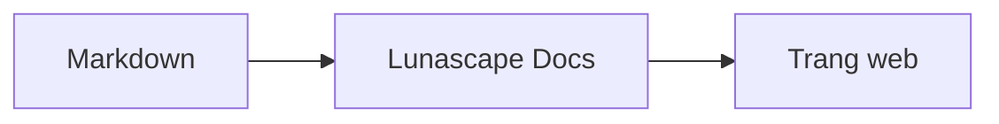

# Viết sơ đồ và biểu đồ

Chỉ cần chỉ định tên ngôn ngữ cho khối mã là nội dung sẽ được vẽ thành sơ đồ hoặc biểu đồ. Toàn bộ việc vẽ diễn ra trên thiết bị của bạn, không tải tài nguyên bên ngoài.

## Các sơ đồ được hỗ trợ

| Tên ngôn ngữ | Sơ đồ | Cách viết |
|---|---|---|
| `mermaid` | Lưu đồ, sơ đồ tuần tự và các loại khác | Cú pháp Mermaid |
| `vega-lite` | Biểu đồ dữ liệu như biểu đồ cột, biểu đồ đường | JSON của Vega-Lite. Nhúng dữ liệu vào `data.values` hoặc `datasets` |
| `markmap` | Sơ đồ tư duy | Tiêu đề và danh sách của Markdown |
| `wavedrom` | Sơ đồ định thời | WaveJSON (JSON nghiêm ngặt) |
| `svgbob` | Sơ đồ cấu trúc bằng ASCII art | Hình vẽ bằng chữ dùng `+`, `-`, `>` và các ký tự kẻ khung |
| `tikz` | Hình vẽ TikZ | Một môi trường `tikzpicture`. Phần `tikzpicture` nằm trong `$$...$$` / `\[...\]` của tài liệu sẵn có cũng được nhận diện |
| `penrose` (thử nghiệm) | Sơ đồ tập hợp | Đặt `@preset set-theory` ở đầu và chỉ dùng `Set`, `Subset`, `Disjoint`, `Intersecting`, `AutoLabel All` |

### Ví dụ: Mermaid

````markdown

````

### Ví dụ: Vega-Lite

````markdown
```vega-lite
{
  "data": { "values": [ { "tháng": "Tháng 4", "số lượng": 12 }, { "tháng": "Tháng 5", "số lượng": 19 } ] },
  "mark": "bar",
  "encoding": {
    "x": { "field": "tháng", "type": "nominal" },
    "y": { "field": "số lượng", "type": "quantitative" }
  }
}
```
````

### Ví dụ: Svgbob

````markdown
```svgbob
+----------+      +----------+
| Markdown | ---> |   SVG    |
+----------+      +----------+
```
````

## Chỉnh sửa

Ở chế độ hiển thị trực quan, sơ đồ được hiển thị dưới dạng kết quả đã vẽ. Để thay đổi nội dung, hãy nhấn [Markdown] trong màn hình chỉnh sửa và sửa mã nguồn. Khi lưu từ chế độ hiển thị trực quan, mã nguồn của sơ đồ vẫn được giữ nguyên.

> **Lưu ý**
>
> - Thư viện vẽ của mỗi loại sơ đồ chỉ được tải khi tài liệu có chứa loại sơ đồ đó.
> - Vega-Lite không dùng được dữ liệu từ URL bên ngoài hay image mark. WaveDrom chỉ chấp nhận JSON nghiêm ngặt, không dùng được dạng JavaScript.
> - SVG được tạo ra sẽ được làm sạch. Kết quả có tham chiếu đến tập lệnh, hình ảnh bên ngoài hoặc kiểu dáng bên ngoài sẽ không được hiển thị.
> - **TikZ**: bản phân phối của tiện ích mở rộng không kèm theo engine vẽ, nên mã nguồn sẽ hiển thị ở dạng thu gọn. Với mục đích phát triển và đánh giá, bạn có thể chọn cài đặt `lunascapeDocEditor.tikz.runtime: "workspace"` để dùng `node_modules/node-tikzjax` (1.0.5) trong Không gian làm việc đáng tin cậy. Bản trình duyệt web không vẽ TikZ.
> - **Penrose**: đây là tính năng thử nghiệm. Cú pháp có thể thay đổi trong tương lai.

## Xem thêm

- [Viết công thức toán](math.md)
- [Sơ đồ, công thức toán hoặc hình ảnh không hiển thị](../07-troubleshooting/rendering.md)
- [Các đặc tả chính](../08-reference/README.md)
