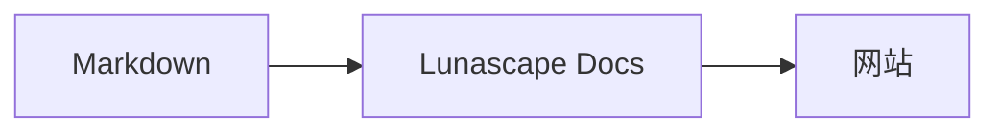

# 绘制图表

只需为代码块指定语言名，即可将其渲染为图表。所有渲染都在本机内完成，不加载任何外部资源。

## 支持的图表

| 语言名 | 图表 | 写法 |
|---|---|---|
| `mermaid` | 流程图、时序图等 | Mermaid 记法 |
| `vega-lite` | 柱状图、折线图等数据图表 | Vega-Lite 的 JSON。数据嵌入在 `data.values` 或 `datasets` 中 |
| `markmap` | 思维导图 | Markdown 的标题和列表 |
| `wavedrom` | 时序图 | WaveJSON（严格 JSON） |
| `svgbob` | ASCII 艺术结构图 | 使用 `+`、`-`、`>` 和制表符绘制的文本图 |
| `tikz` | TikZ 图 | 一个 `tikzpicture` 环境。也可识别现有文档中 `$$...$$` / `\[...\]` 内的 `tikzpicture` |
| `penrose`（实验性） | 集合图 | 开头放置 `@preset set-theory`，并仅使用 `Set`、`Subset`、`Disjoint`、`Intersecting`、`AutoLabel All` 编写 |

### 示例：Mermaid

````markdown

````

### 示例：Vega-Lite

````markdown
```vega-lite
{
  "data": { "values": [ { "月份": "4月", "件数": 12 }, { "月份": "5月", "件数": 19 } ] },
  "mark": "bar",
  "encoding": {
    "x": { "field": "月份", "type": "nominal" },
    "y": { "field": "件数", "type": "quantitative" }
  }
}
```
````

### 示例：Svgbob

````markdown
```svgbob
+----------+      +----------+
| Markdown | ---> |   SVG    |
+----------+      +----------+
```
````

## 编辑

在可视化视图中，图表以渲染结果的形式显示。要修改内容，请在编辑界面中按 [Markdown] 编辑源代码。从可视化视图保存时，图表的源代码会原样保留。

> **注意**
>
> - 每种图表的渲染库只在文档包含该类图表时才会加载。
> - Vega-Lite 不能使用外部 URL 的数据或图像标记。WaveDrom 只接受严格 JSON，不支持 JavaScript 形式。
> - 生成的 SVG 会经过无害化处理。包含脚本、外部图像或外部样式引用的结果不会显示。
> - **TikZ**：发行版扩展未内置渲染引擎，因此会显示折叠的源代码。出于开发和评估目的，可选择设置 `lunascapeDocEditor.tikz.runtime: "workspace"`，使用受信任的工作区中的 `node_modules/node-tikzjax`（1.0.5）。Web 浏览器版不渲染 TikZ。
> - **Penrose**：实验性功能。记法今后可能会变化。

## 相关主题

- [编写数学公式](math.md)
- [图表、数学公式或图像不显示](../07-troubleshooting/rendering.md)
- [主要规格](../08-reference/README.md)
