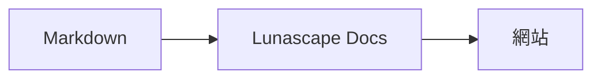

# 繪製圖表與圖形

只要為程式碼區塊指定正確的語言名稱，就會將它繪製成圖表或圖形。所有繪製都在您的裝置內完成，不會載入任何外部資源。

## 支援的圖表

| 語言名稱 | 圖表 | 寫法 |
|---|---|---|
| `mermaid` | 流程圖、序列圖等 | Mermaid 的語法 |
| `vega-lite` | 長條圖、折線圖等資料圖形 | Vega-Lite 的 JSON。資料嵌入於 `data.values` 或 `datasets` |
| `markmap` | 心智圖 | Markdown 的標題與項目符號 |
| `wavedrom` | 時序圖 | WaveJSON（嚴格 JSON） |
| `svgbob` | ASCII 藝術構成圖 | 使用 `+`、`-`、`>` 與框線字元的文字圖 |
| `tikz` | TikZ 圖表 | 一個 `tikzpicture` 環境。也能辨識現有文件中 `$$...$$` / `\[...\]` 內的 `tikzpicture` |
| `penrose`（實驗性） | 集合圖 | 開頭放上 `@preset set-theory`，只使用 `Set`、`Subset`、`Disjoint`、`Intersecting`、`AutoLabel All` 撰寫 |

### 範例：Mermaid

````markdown

````

### 範例：Vega-Lite

````markdown
```vega-lite
{
  "data": { "values": [ { "月份": "4月", "件數": 12 }, { "月份": "5月", "件數": 19 } ] },
  "mark": "bar",
  "encoding": {
    "x": { "field": "月份", "type": "nominal" },
    "y": { "field": "件數", "type": "quantitative" }
  }
}
```
````

### 範例：Svgbob

````markdown
```svgbob
+----------+      +----------+
| Markdown | ---> |   SVG    |
+----------+      +----------+
```
````

## 編輯

在視覺化檢視中，圖表會以繪製結果顯示。若要變更內容，請在編輯畫面按下 [Markdown] 以編輯原始碼。即使從視覺化檢視儲存，圖表的原始碼也會原樣保留。

> **注意**
>
> - 各圖表的繪製函式庫，只有在文件包含該種圖表時才會載入。
> - Vega-Lite 無法使用外部 URL 的資料或圖片標記。WaveDrom 只接受嚴格 JSON，無法使用 JavaScript 形式。
> - 產生的 SVG 會經過無害化處理。凡是參照指令碼、外部圖片或外部樣式的結果，都不會顯示。
> - **TikZ**：發佈版的擴充功能並未內建繪製引擎，因此會顯示折疊的原始碼。若用於開發與評估，可選擇 `lunascapeDocEditor.tikz.runtime: "workspace"` 設定，使用受信任的工作區中根目錄下的 `node_modules/node-tikzjax`（1.0.5）。Web 檢視器不會繪製 TikZ。
> - **Penrose**：實驗性功能。語法今後可能會變更。

## 相關項目

- [撰寫數學式](math.md)
- [圖表、數學式或圖片無法顯示](../07-troubleshooting/rendering.md)
- [主要規格](../08-reference/README.md)
