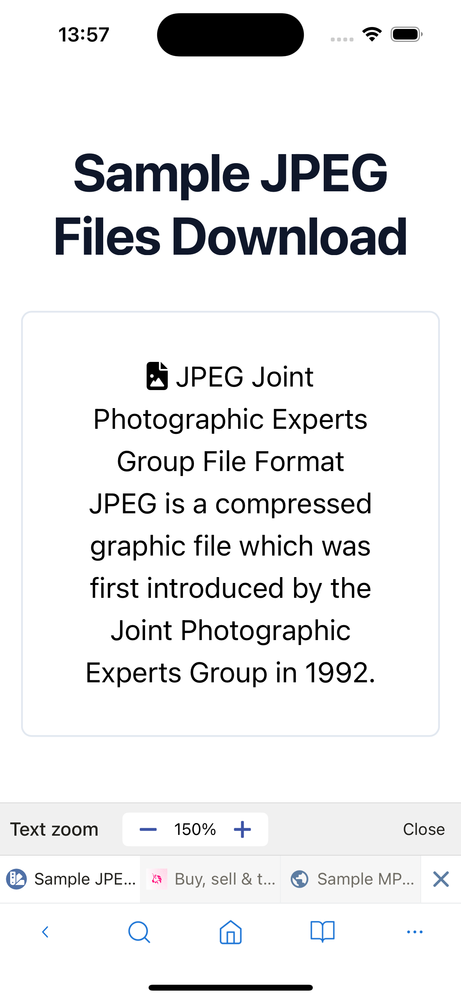

---
navigation:
  order: 1200
---

# Browser Tool Menu

The Browser Tool Menu contains actions for the page and tab currently open.

## Save or find content

- **Add to Bookmark** saves the page to Bookmarks.
- **Add to Reading List** saves it for later.
- **Add to Shortcuts** adds a Home screen shortcut.
- **Find in Page** searches for text on the current page.

## Adjust the page

- **Text Zoom** changes the page's text size by percentage.
- **Desktop Site / Mobile Site** requests the corresponding version of the website.
- **Reload** loads the current page again.

## Capture, download, or share

- **Capture Page** saves an image of the current page in Downloads.
- **Download Page** saves the page HTML. When the current address is a direct PDF link, it downloads the PDF.
- **Print** opens the system print controls.
- **Share** opens the system share sheet.

## Manage tabs

- **Close** closes the current tab.
- **Close Other Tabs** closes every tab except the current one.

> **Note:** Available actions can vary by platform and page type.
