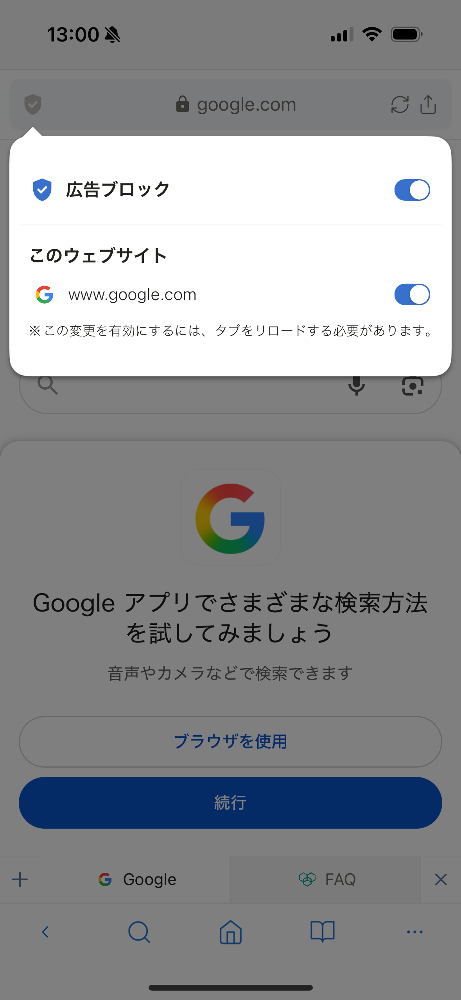

# 広告ブロック

広告ブロックを有効にすると、対応しているWebサイト上の広告を減らせます。この機能は初期状態では無効です。

## 広告ブロックを有効にする

1. **設定**を開きます。
2. **一般**をタップします。
3. **広告ブロッカー**を有効にします。
4. 開いているWebページを再読み込みします。

## 特定のサイトで広告を許可する

1. **設定** > **広告ブロッカー** > **許可リスト**を開きます。
2. 広告を許可するサイトを追加します。
3. 対象のWebページを再読み込みします。

許可リストに追加したサイトでは、広告ブロックは動作しません。

> **注意:** 広告ブロックを有効にすると、一部のサイトで表示や操作に問題が起きることがあります。その場合は対象サイトを許可リストに追加してください。

## 関連項目

- [一般設定](../../../settings/i18n/ja/general.md)
- [プライベートモード](private-mode.md)
