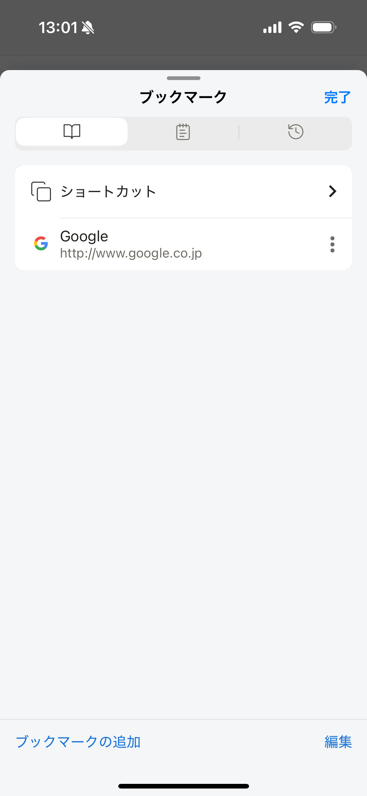

# ブックマーク

よく使うWebページをブックマークに保存し、フォルダーで整理できます。

## 表示中のページを追加する

1. 保存したいWebページを開きます。
2. ブラウザのツールメニューを開きます。
3. **ブックマークに追加**をタップします。
4. 名前と保存先を確認して保存します。

## ブックマークを整理する

ブックマーク画面では、次の操作ができます。

- ブックマークの追加、編集、削除
- フォルダーの作成
- 並び順や保存先の変更
- ホーム画面のショートカットへの追加

## 関連項目

- [ブラウザショートカット](../../../home/i18n/ja/browser-shortcuts.md)
- [ブラウザツールメニュー](browser-tool-menu.md)
