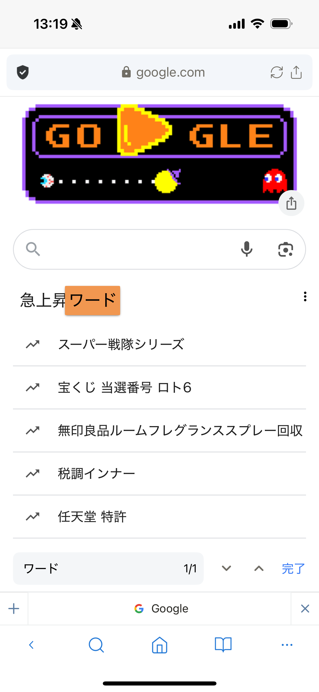
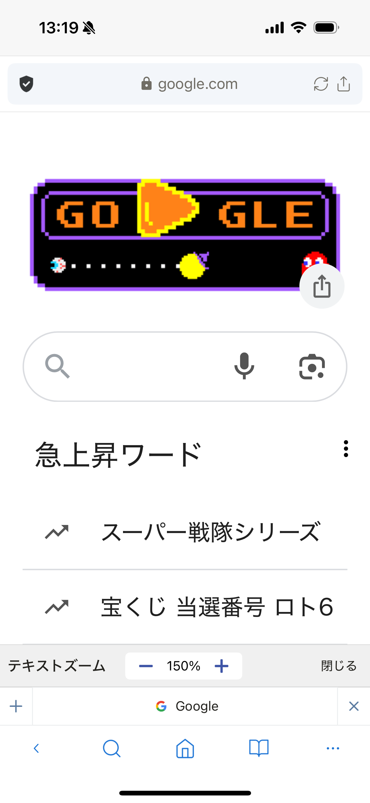

# ブラウザツールメニュー

ブラウザのツールメニューには、表示中のWebページで使える操作がまとめられています。

## 保存・検索

- **ブックマークに追加**：ページをブックマークへ保存します。
- **リーディングリストに追加**：あとで読むページとして保存します。
- **ショートカットに追加**：ホーム画面から開けるリンクを作成します。
- **ページ内検索**：表示中のページから文字列を探します。

## 表示を調整する

- **テキストズーム**：ページ内の文字サイズをパーセント単位で変更します。
- **デスクトップサイト／モバイルサイト**：サイトへ要求する表示形式を切り替えます。

## 保存・共有

- **ページをキャプチャ**：ページのスクリーンショットを撮影し、**Downloads**フォルダーへ保存します。
- **ページをダウンロード**：通常のページはHTMLとして保存します。PDFファイルへの直接リンクではPDFを保存します。
- **印刷**：対応するプリンターでページを印刷します。
- **共有**：ほかのアプリへページを送ります。

## ページとタブを操作する

- **再読み込み**：表示中のページを読み込み直します。
- **閉じる**：表示中のタブを閉じます。
- **ほかのタブを閉じる**：表示中のタブ以外を閉じます。

> **注意:** Webサイトの構成によっては、ページのキャプチャやダウンロードが正しく完了しない場合があります。

## 関連項目

- [ファイルダウンロード](download-file.md)
- [タブ操作](tab-operations.md)
