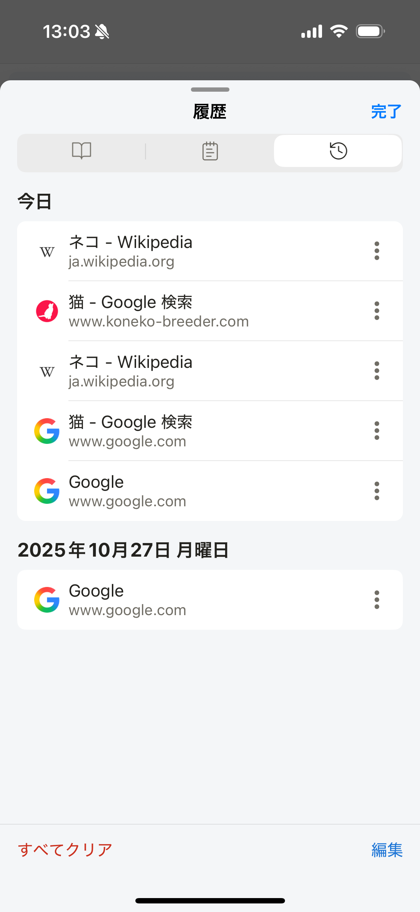

# ブラウジング履歴

閲覧したWebページは日付ごとに履歴へ保存されます。履歴から以前のページを開き直すことができます。

## 履歴からページを開く

1. ブラウザのツールメニューを開きます。
2. **履歴**をタップします。
3. 開きたいページをタップします。

## 履歴を削除する

履歴画面では、項目を個別に削除するか、すべての履歴を一括で削除できます。

> **注意:** 削除した履歴は元に戻せません。履歴を残さず閲覧する場合は、閲覧前に[プライベートモード](private-mode.md)へ切り替えてください。

## 関連項目

- [履歴設定](../../../settings/i18n/ja/history.md)
- [プライベートモード](private-mode.md)
