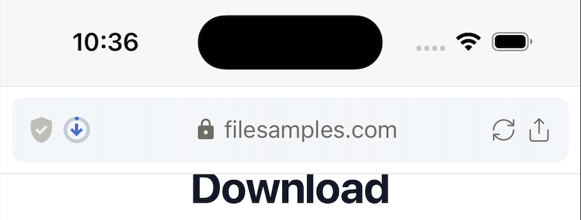
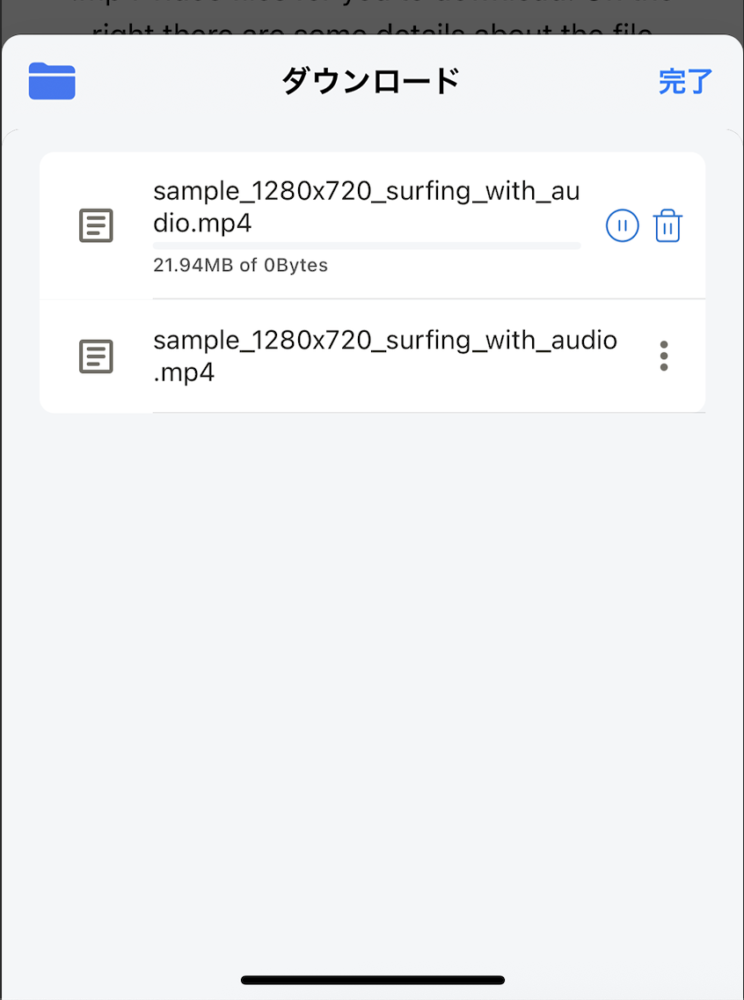

---
navigation:
  title: "ファイルダウンロード"
---

# ファイルダウンロード

Lunascapeでは、音声、動画、画像、文書など、Webサイトが提供する各種ファイルをダウンロードできます。

## ファイルをダウンロードする

1. Webページ上のダウンロードリンクをタップします。
2. 確認画面が表示された場合は、ファイル名と保存内容を確認します。
3. **ダウンロード**をタップします。
4. ダウンロード一覧で進行状況を確認します。

ダウンロード中の項目は一時停止、再開、キャンセルできます。完了したファイルは開く、名前を変更する、削除するなどの操作ができます。

## 保存場所

| 端末 | 保存場所 | アプリを削除した場合 |
| --- | --- | --- |
| iOS | **このiPhone内** > **Lunascape** > **Downloads**。ファイルアプリからも確認できます。 | Lunascape内のダウンロードファイルも削除されます。 |
| Android | **Downloads/Lunascape**。対応するファイル管理アプリからも確認できます。 | ダウンロードファイルは端末に残ります。 |

> **注意:** 不明なサイトからダウンロードしたファイルは開かないでください。iOSでアプリを削除する前に、残したいファイルを別の場所へ移動してください。
